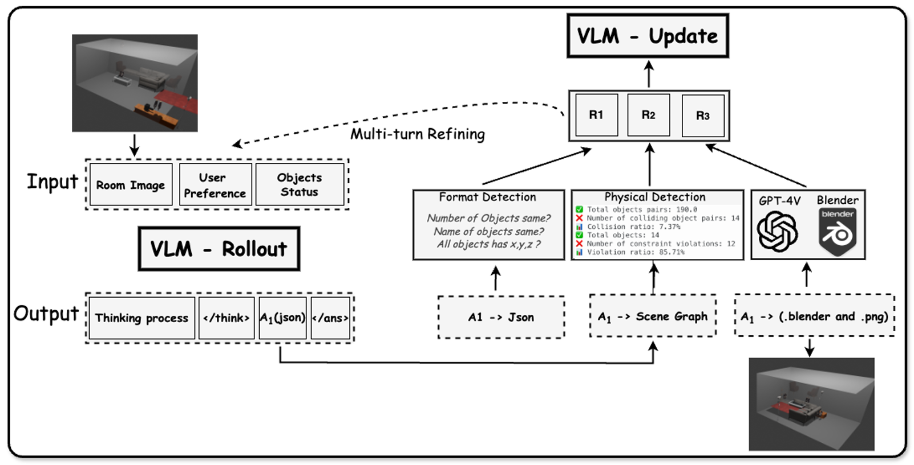
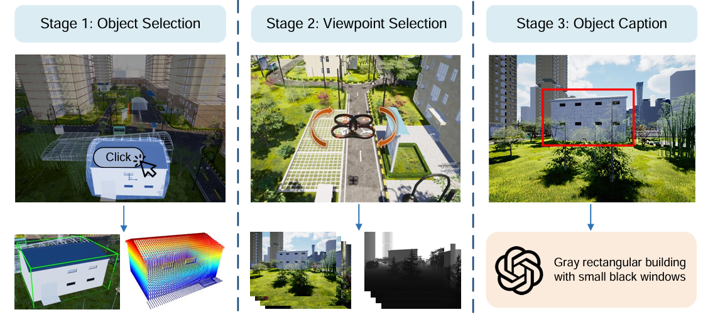
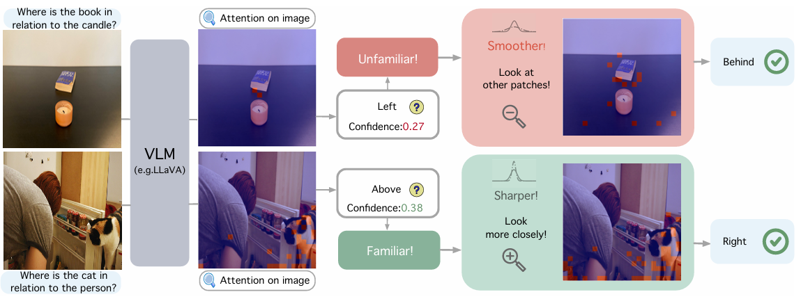
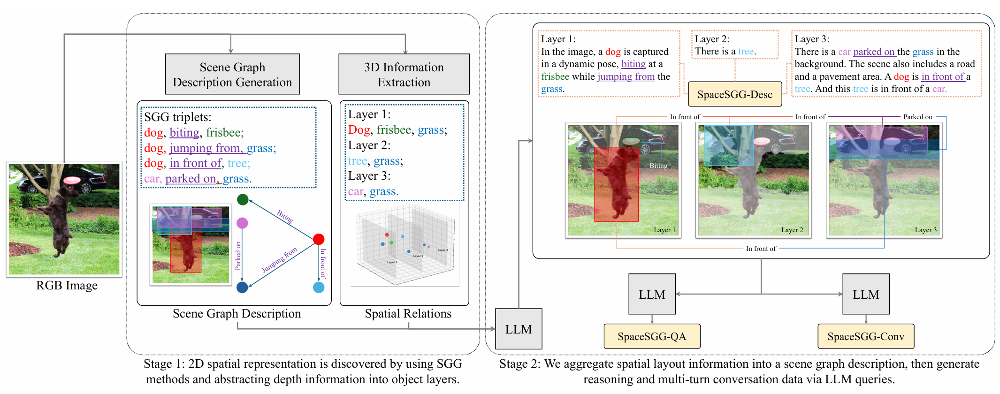
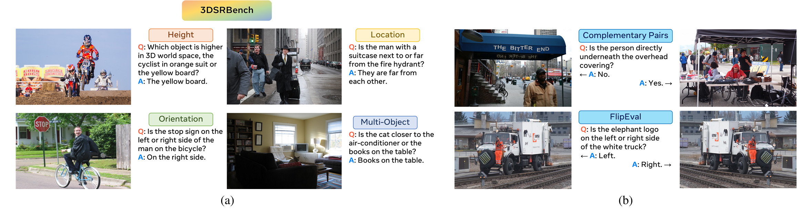
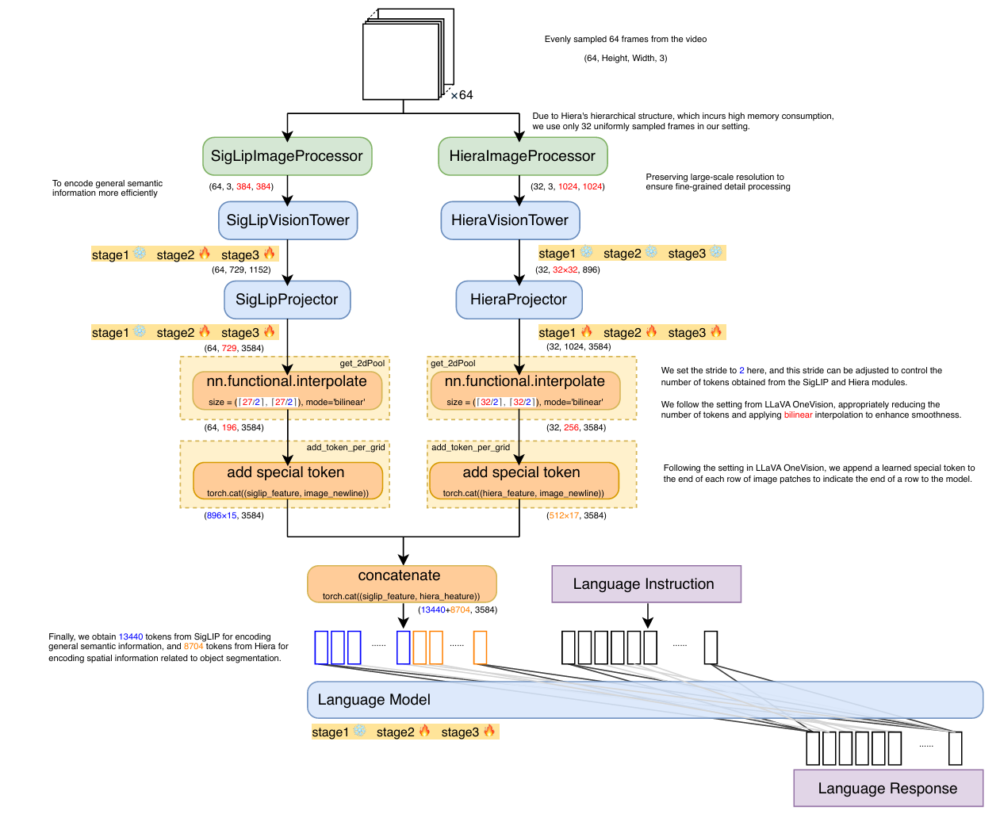
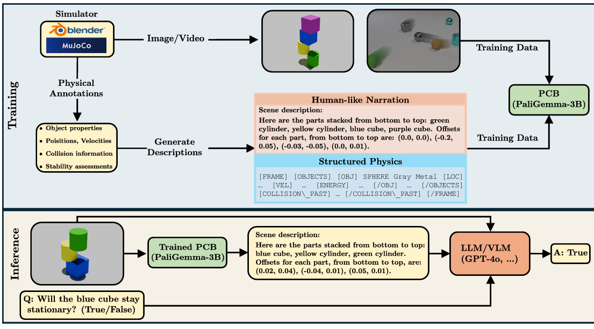
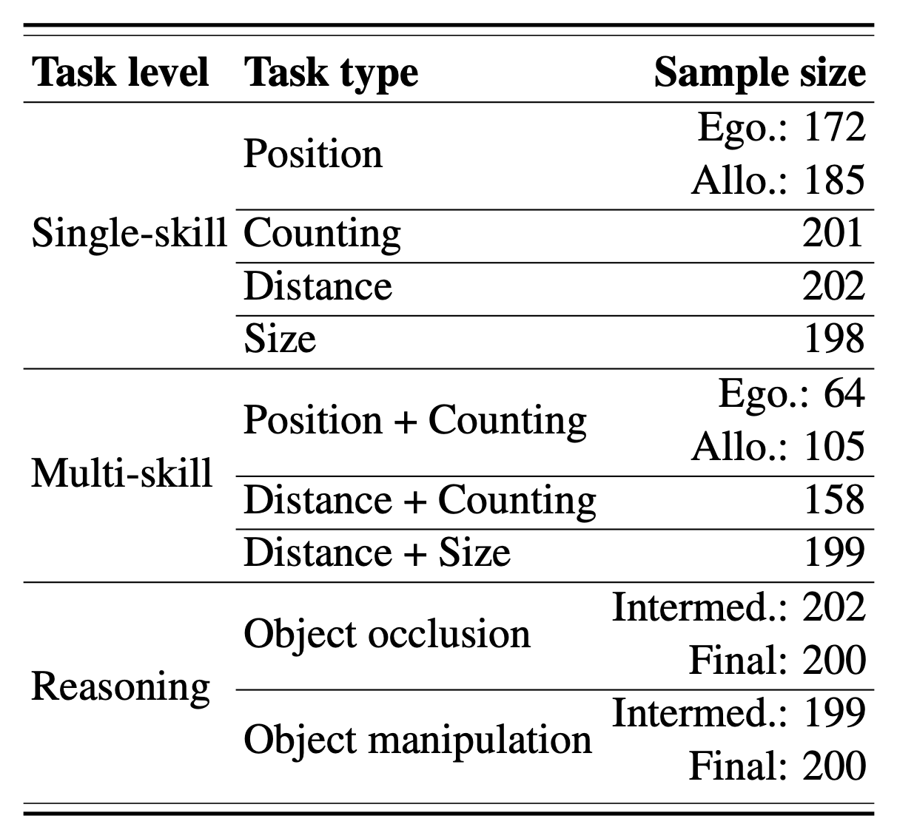

# Awesome Visual Spatial Reasoning

<div align="center">
  <a href="https://song2yu.github.io/">Songsong Yu</a><sup>*1,2</sup>,
  <a href="https://github.com/Uason-Chen">Yuxin Chen</a><sup>🌟*2</sup>,
  <a href="https://haodot.github.io/">Hao Ju</a><sup>*3</sup>,
  <a href="https://github.com/JiaLianjie">Lianjie Jia</a><sup>*4</sup>,
  <a href="https://github.com/Dustzx">Fuxi Zhang</a><sup>4</sup>,
  <a href="https://spyflying.github.io/">Shaofei Huang</a><sup>3</sup>,
  <br>
  <a href="https://github.com/YuhanWu27">Yuhan Wu</a><sup>4</sup>,
  <a href="https://github.com/Cuirundi">Rundi Cui</a><sup>4</sup>,
  <a href="https://github.com/RBinghao">Binghao Ran</a><sup>4</sup>,
  <a href="https://scholar.google.com/citations?user=3SAk3GQAAAAJ&hl=en">Zhang Zaibin</a><sup>4</sup>,
  <a href="https://www.zdzheng.xyz/" target="_blank" >Zhedong Zheng</a><sup>3</sup>,
  <a href="https://zhipengzhang.cn/">Zhipeng Zhang</a><sup>1</sup>,
  <br>
  <a href="https://scholar.google.com/citations?user=j1XFhSoAAAAJ&hl=en&oi=ao" >Yifan Wang</a><sup>4</sup>,
  <a href="https://github.com/StevenGrove">Lin Song</a><sup>2</sup>,
  <a href="https://scholar.google.com/citations?hl=en&user=EfTwkXMolscC&view_op=list_works&sortby=pubdate" >Lijun Wang</a><sup>4</sup>,
  <a href="https://yanwei-li.com/">Yanwei Li</a><sup>✉️5</sup>,
  <a href="https://scholar.google.com/citations?user=4oXBp9UAAAAJ&hl=en&oi=ao" >Ying Shan</a><sup>2</sup>,
  <a href="https://scholar.google.com/citations?hl=en&user=D3nE0agAAAAJ" >Huchuan Lu</a><sup>4</sup>,
  <br><br>
  <sup>1</sup>SJTU,
  <sup>2</sup>ARC Lab, Tencent PCG,
  <sup>3</sup>UM,
  <sup>4</sup>DLUT,
  <sup>5</sup>CUHK
  * Equal Contributions
  🌟 Project Lead
  ✉️ Corresponding Author

<p align="center">
🤗 <a href="https://huggingface.co/datasets/Two-hot/SIBench"> Dataset </a>&nbsp&nbsp | &nbsp&nbsp🌐 <a href="https://sibench.github.io/Awesome-Visual-Spatial-Reasoning/"> Leaderboard</a>&nbsp&nbsp | &nbsp&nbsp📊 <a href="https://github.com/SIBench/Awesome-Visual-Spatial-Reasoning"> Survey </a>&nbsp&nbsp | &nbsp&nbsp🎯 <a href="https://github.com/song2yu/SIBench-VSR"> Code </a>&nbsp&nbsp | &nbsp&nbsp📄 <a href="https://arxiv.org/abs/2509.18905">arXiv</a>
</p>

</div>
<br>


<p align="center">
  
  
  
  
    

</p>

# News and Updates

- [x] 📜📜📜25.9.23 - Preprint a survey article on visual spatial reasoning tasks.
- [x] 🎯🎯🎯25.9.23 - Release comprehensive evaluation results of mainstream models in visual spatial reasoning.
- [x] 🙌👏👐25.9.15 - [Open-source evaluation data](https://huggingface.co/datasets/Two-hot/SIBench) for visual spatial reasoning tasks.
- [x] 🤩🥳🤗25.9.15 - [Open-source evaluation toolkit](https://github.com/song2yu/SIBench_eval).
- [x] ✍️🦾💼25.6.28 - Collected the "Datasets" section.
- [x] 🏃🏃‍♀️🏃‍♂️25.6.16 - The "Awesome Visual Spatial Reasoning" project is now live!
- [x] 👏🕮💻25.6.12 - The project has conducted research and collected 100 relevant works.
- [x] 🙋‍♀️🙋‍♂️🙋25.6.10 - We launches a review project on visual spatial reasoning.


# Open-source evaluation toolkit


<h6 align="center"> Evaluation of SOTA Models on 23 Visual Spatial Reasoning Tasks.</h6>

[**Code Usage**](https://github.com/song2yu/SIBench_eval):

```bash
- git clone https://github.com/song2yu/SIBench-VSR.git
- Refer to the README.md for more details
```

# Contributing

> We welcome contributions to this repository! If you would like to contribute, please follow these steps:
>
> - Fork the repository.
> - Create a new branch with your changes.
> - Submit a pull request with a clear description of your changes.
>
> You can also open an issue if you have anything to add or comment.
>
> Please feel free to contact us (SongsongYu203@163.com).


# Overview

The research community is increasingly focused on the **visual spatial reasoning** (VSR) abilities of Vision-Language Models (VLMs). Yet, the field **lacks** a **clear overview of its evolution** and a **standardized benchmark for evaluation**. Current assessment methods are disparate and **lack a common toolkit**. This project aims to fill that void. We are developing a unified, comprehensive, and diverse evaluation toolkit, along with an accompanying survey paper. We are actively seeking collaboration and discussion with fellow experts to advance this initiative. 

# Task Explanation

Visual spatial understanding is a key task at the intersection of computer vision and cognitive science. It aims to **enable intelligent agents** (such as robots and AI systems) to **parse spatial relationships** in the environment **through visual inputs** (images, videos, etc.), forming an abstract cognition of the physical world. In Embodied Intelligence, it serves as the foundation for agents to achieve the "perception-decision-action" loop—only by understanding attributes like object positions, distances, sizes, and orientations in space can intelligent agents navigate environments, manipulate objects, or interact with humans.


# Timeline


# Citation

If you find this project useful, please consider citing:
```
@article{sibench2025,
  title={How Far are VLMs from True Visual Spatial Intelligence? A Benchmark-Driven Perspective},
  author={Songsong Yu, Yuxin Chen, Hao Ju, Lianjie Jia, Fuxi Zhang, Shaofei Huang, Yuhan Wu, Rundi Cui, Binghao Ran, Zaibin Zhang, Zhedong Zheng, Zhipeng Zhang, Yifan Wang, Lin Song, Lijun Wang, Yanwei Li, Ying Shan, Huchuan Lu},
  journal={arXiv preprint arXiv:2509.18905},
  year={2025}
}
```


# Table of Contents

To facilitate the community's quick understanding of visual-spatial reasoning, we first categorized it by input modalities into **Single image**, **Monocular Video**, and **Multi-View Images**. We also surveyed other input modalities such as point clouds, as well as specific applications like embodied robotics. These are temporarily grouped under "**Others**," and we will conduct a more detailed sorting in the future.

- [Evaluation Results](#evaluation-results)
- [Papers](#Papers)
  - [Single Image](#Single-Image)
  - [Monocular Video](#Monocular-Video)
  - [Multi-View Images](#Multi-View-Images)
  - [Others](#Others)
- [Datasets](#Datasets)

# Papers


## Single Image
<table>
<colgroup>
  <col style="width: 25%">
  <col style="width: 10%">
  <col style="width: 8%">
  <col style="width: 10%">
  <col style="width: 10%">
  <col style="width: 7%">
  <col style="width: 30%">
</colgroup>
<thead>
<tr>
  <th>Title</th>
  <th>Venue</th>
  <th>Date</th>
  <th>Code</th>
  <th>Stars</th>
  <th>Benchmark</th>
  <th>Illustration</th>
</tr>
</thead>
<tbody>
  <tr>
    <td><a href="https://openreview.net/pdf?id=Ku4lylDpjq">R2D3:ImpartingSpatial Reasoning by Reconstructing 3D Scenes from 2D Images</a></td>
    <td>ARXIV</td>
    <td>--</td>
    <td>--</td>
    <td>--</td>
    <td>R2D3</td>
    <td></td>
  </tr>
  <tr>
    <td><a href="https://arxiv.org/pdf/2506.04308">RoboRefer: Towards Spatial Referring with Reasoning in Vision-Language Models for Robtics</a></td>
    <td>ARXIV</td>
    <td>25-06</td>
    <td><a href="https://zhoues.github.io/RoboRefer/">link</a></td>
    <td>--</td>
    <td>RefSpatial-Bench</td>
    <td></td>
  </tr>
  <tr>
    <td><a href="https://arxiv.org/abs/2506.00123">Visual Embodied Brain: Let Multimodal Large Language Models See, Think, and Control in Spaces</a></td>
    <td>ARXIV</td>
    <td>25-06</td>
    <td><a href="https://github.com/OpenGVLab/VeBrain">link</a></td>
    <td></td>
    <td>VeBrain-600k</td>
    <td></td>
  </tr>
  <tr>
    <td><a href="https://arxiv.org/pdf/2506.01371?">SVQA-R1: Reinforcing Spatial Reasoning in MLLMs via View-Consistent Reward Optimization</a></td>
    <td>ARXIV</td>
    <td>25-06</td>
    <td>--</td>
    <td>--</td>
    <td>SVQA-R1</td>
    <td></td>
  </tr>
  <tr>
    <td><a href="https://arxiv.org/abs/2506.03135">OmniSpatial: Towards Comprehensive Spatial Reasoning Benchmark for Vision Language Models</a></td>
    <td>--</td>
    <td>25-06</td>
    <td><a href="https://github.com/qizekun/OmniSpatial">link</a></td>
    <td></td>
    <td>OmniSpatial</td>
    <td></td>
  </tr>
  <tr>
    <td><a href="https://arxiv.org/pdf/2505.19015">Can Multimodal Large Language Models Understand Spatial Relations</a></td>
    <td>ARXIV</td>
    <td>25-05</td>
    <td><a href="https://github.com/ziyan-xiaoyu/SpatialMQA">link</a></td>
    <td></td>
    <td>SpatialMQA</td>
    <td></td>
  </tr>
  <tr>
    <td><a href="https://arxiv.org/abs/2505.12448">SSR: Enhancing Depth Perception in Vision-Language Models via Rationale-Guided Spatial Reasoning</a></td>
    <td>--</td>
    <td>25-05</td>
    <td>--</td>
    <td>--</td>
    <td>SSR-CoT</td>
    <td></td>
  </tr>
  <tr>
    <td><a href="https://arxiv.org/pdf/2505.12194">Spatial-LLaVA: Enhancing Large Language Models with Spatial Referring Expressions for Visual Understanding</a></td>
    <td>ARXIV</td>
    <td>25-05</td>
    <td><a href="https://arpg.github.io/sunspot/">link</a></td>
    <td>--</td>
    <td>SUNSPOT</td>
    <td></td>
  </tr>
  <tr>
    <td><a href="https://arxiv.org/pdf/2505.11907">Are Multimodal Large Language Models Ready for Omnidirectional Spatial Reasoning?</a></td>
    <td>ARXIV</td>
    <td>25-05</td>
    <td><a href="https://huggingface.co/datasets/UUUserna/OSR-Bench">link</a></td>
    <td>--</td>
    <td>OSR-Bench</td>
    <td></td>
  </tr>
  <tr>
    <td><a href="https://arxiv.org/pdf/2505.05456">SITE: towards Spatial Intelligence Thorough Evaluation</a></td>
    <td>ARXIV</td>
    <td>25-05</td>
    <td><a href="https://github.com/wenqi-wang20/SITE-Bench">link</a></td>
    <td></td>
    <td>SITE</td>
    <td></td>
  </tr>
  <tr>
    <td><a href="https://arxiv.org/pdf/2505.15966">Pixel Reasoner: Incentivizing Pixel-Space Reasoning with Curiosity-Driven Reinforcement Learning</a></td>
    <td>ARXIV</td>
    <td>25-05</td>
    <td>--</td>
    <td>--</td>
    <td>TallyQA, V*<br>InfographicVQA, MVBench</td>
    <td></td>
  </tr>
  <tr>
    <td><a href="https://arxiv.org/pdf/2504.00883">Improved Visual-Spatial Reasoning via R1-Zero-Like Training</a></td>
    <td>ARXIV</td>
    <td>25-04</td>
    <td><a href="https://github.com/zhijie-group/R1-Zero-VSI">link</a></td>
    <td></td>
    <td>VSI-100K</td>
    <td></td>
  </tr>
  <tr>
    <td><a href="https://arxiv.org/abs/2504.17207">Perspective-Aware Reasoning in Vision-Language Models via Mental Imagery Simulation</a></td>
    <td>ARXIV</td>
    <td>25-04</td>
    <td><a href="https://github.com/KAIST-Visual-AI-Group/APC-VLM">link</a></td>
    <td></td>
    <td>COMFORT++, 3DSRBench</td>
    <td></td>
  </tr>
  <tr>
    <td><a href="https://arxiv.org/pdf/2504.20024?">SpatialReasoner: Towards Explicit and Generalizable 3D Spatial Reasoning</a></td>
    <td>ARXIV</td>
    <td>25-04</td>
    <td><a href="https://spatial-reasoner.github.io/">link</a></td>
    <td>--</td>
    <td>--</td>
    <td></td>
  </tr>
  <tr>
    <td><a href="https://arxiv.org/pdf/2504.16061">Vision language models are unreliable at trivial spatial cognition</a></td>
    <td>ARXIV</td>
    <td>25-04</td>
    <td>--</td>
    <td>--</td>
    <td>TableTest</td>
    <td></td>
  </tr>
  <tr>
    <td><a href="https://arxiv.org/abs/2504.20648">SpaRE: Enhancing Spatial Reasoning in Vision-Language Models with Synthetic Data</a></td>
    <td>ARXIV</td>
    <td>25-04</td>
    <td>--</td>
    <td>--</td>
    <td>vsr, what's up<br>3DSR-Bench, RealWorldQA</td>
    <td></td>
  </tr>
  <tr>
    <td><a href="https://arxiv.org/pdf/2504.03164">NUSCENES-SPATIALQA: A Spatial Understanding and Reasoning Benchmark for Vision-Language Models in Autonomous Driving</a></td>
    <td>ARXIV</td>
    <td>25-04</td>
    <td><a href="https://github.com/taco-group/NuScenes-SpatialQA">link</a></td>
    <td></td>
    <td>NuScenes-SpatialQA</td>
    <td></td>
  </tr>
  <tr>
    <td><a href="https://arxiv.org/pdf/2503.17349">Beyond Semantics Rediscovering Spatial Awareness in Vision-Language Models</a></td>
    <td>--</td>
    <td>25-03</td>
    <td><a href="https://user074.github.io/respatialaware/">link</a></td>
    <td>--</td>
    <td>--</td>
    <td></td>
  </tr>
  <tr>
    <td><a href="https://arxiv.org/pdf/2503.18470">MetaSpatial: Reinforcing 3D Spatial Reasoning in
VLMs for the Metaverse</a></td>
    <td>ARXIV</td>
    <td>25-03</td>
    <td><a href="https://github.com/PzySeere/MetaSpatial">link</a></td>
    <td></td>
    <td>MetaSpatial</td>
    <td></td>
  </tr>
  <tr>
    <td><a href="https://arxiv.org/pdf/2503.19707?">Mind the Gap: Benchmarking Spatial Reasoning in Vision-Language Models</a></td>
    <td>ARXIV</td>
    <td>25-03</td>
    <td><a href="https://github.com/stogiannidis/srbench">link</a></td>
    <td></td>
    <td>SRBench</td>
    <td></td>
  </tr>
  <tr>
    <td><a href="https://arxiv.org/pdf/2503.11094">Open3DVQA: ABenchmark for Comprehensive Spatial Reasoning with Multimodal Large Language Model in Open Space</a></td>
    <td>ARXIV</td>
    <td>25-03</td>
    <td><a href="https://github.com/WeichenZh/Open3DVQA">link</a></td>
    <td></td>
    <td>Open3DVQA</td>
    <td></td>
  </tr>
  <tr>
    <td><a href="https://arxiv.org/pdf/2503.07557">AutoSpatial: Visual-Language Reasoning for Social Robot Navigation through Efficient Spatial Reasoning Learning</a></td>
    <td>ARXIV</td>
    <td>25-03</td>
    <td><a href="https://github.com/Yanko96/AutoSpatial">link</a></td>
    <td></td>
    <td>AutoSpatial</td>
    <td></td>
  </tr>
  <tr>
    <td><a href="https://arxiv.org/pdf/2503.01773">Why Is Spatial Reasoning Hard for VLMs? AnAttention Mechanism Perspective on Focus Areas</a></td>
    <td>ARXIV</td>
    <td>25-03</td>
    <td><a href="https://github.com/shiqichen17/AdaptVis">link</a></td>
    <td></td>
    <td>--</td>
    <td></td>
  </tr>
  <tr>
    <td><a href="https://arxiv.org/pdf/2503.19990">LEGO-Puzzles: How Good Are MLLMs at Multi-Step Spatial Reasoning</a></td>
    <td>ARXIV</td>
    <td>25-03</td>
    <td><a href="https://github.com/Tangkexian/LEGO-Puzzles">link</a></td>
    <td></td>
    <td>LEGO-Puzzles</td>
    <td></td>
  </tr>
  <tr>
    <td><a href="https://arxiv.org/pdf/2502.06787">Visual Agentic AI for Spatial Reasoning with a Dynamic API</a></td>
    <td>ARXIV</td>
    <td>25-02</td>
    <td><a href="https://github.com/damianomarsili/VADAR">link</a></td>
    <td></td>
    <td>--</td>
    <td></td>
  </tr>
  <tr>
    <td><a href="https://arxiv.org/pdf/2502.03214">iVISPAR —AnInteractive Visual-Spatial Reasoning Benchmark for VLMs</a></td>
    <td>ARXIV</td>
    <td>25-02</td>
    <td><a href="https://github.com/SharkyBamboozle/iVISPAR">link</a></td>
    <td></td>
    <td>iVISPAR</td>
    <td></td>
  </tr>
  <tr>
    <td><a href="https://arxiv.org/abs/2502.06787">Visual Agentic AI for Spatial Reasoning with a Dynamic API</a></td>
    <td>ARXIV</td>
    <td>25-02</td>
    <td><a href="https://github.com/damianomarsili/VADAR">link</a></td>
    <td></td>
    <td>Q-Spatial Bench, VSI-Bench</td>
    <td></td>
  </tr>
  <tr>
    <td><a href="https://arxiv.org/pdf/2502.11859">Defining and Evaluating Visual Language Models’ Basic Spatial Abilities: A Perspective from Psychometrics</a></td>
    <td>ARXIV</td>
    <td>25-02</td>
    <td>--</td>
    <td>--</td>
    <td>BSA-Tests</td>
    <td></td>
  </tr>
  <tr>
    <td><a href="https://arxiv.org/abs/2502.08317">Mitigating Hallucinations in Multimodal Spatial Relations through Constraint-Aware Prompting</a></td>
    <td>NAACL</td>
    <td>25-02</td>
    <td><a href="https://github.com/TIGER-AI-Lab/Pixel-Reasoner">link</a></td>
    <td></td>
    <td>ARO, GQA<br>MMRel</td>
    <td></td>
  </tr>
  <tr>
    <td><a href="https://openreview.net/pdf?id=84pDoCD4lH">Do Vision-Language Models Represent Space and How. Evaluating Spatial Frame of Reference under Ambiguities</a></td>
    <td>ICLR</td>
    <td>25-01</td>
    <td><a href="https://spatial-comfort.github.io/">link</a></td>
    <td>--</td>
    <td>COMFORT</td>
    <td></td>
  </tr>
  <tr>
    <td><a href="https://openaccess.thecvf.com/content/CVPR2025/papers/Song_RoboSpatial_Teaching_Spatial_Understanding_to_2D_and_3D_Vision-Language_Models_CVPR_2025_paper.pdf">ROBOSPATIAL: Teaching Spatial Understanding to 2D and 3D Vision-Language
 Models for Robotics</a></td>
    <td>CVPR</td>
    <td>25-01</td>
    <td>--</td>
    <td>--</td>
    <td>--</td>
    <td></td>
  </tr>
  <tr>
    <td><a href="https://openaccess.thecvf.com/content/CVPR2025/papers/Wang_Spatial457_A_Diagnostic_Benchmark_for_6D_Spatial_Reasoning_of_Large_CVPR_2025_paper.pdf">Spatial457: A Diagnostic Benchmark for 6D Spatial Reasoning of Large Multimodal Models</a></td>
    <td>CVPR</td>
    <td>25-01</td>
    <td>--</td>
    <td>--</td>
    <td>--</td>
    <td></td>
  </tr>
  <tr>
    <td><a href="https://openaccess.thecvf.com/content/CVPR2025/papers/Liu_Coarse_Correspondences_Boost_Spatial-Temporal_Reasoning_in_Multimodal_Language_Model_CVPR_2025_paper.pdf">COARSE CORRESPONDENCES Boost Spatial-Temporal Reasoning
 in Multimodal Language Model</a></td>
    <td>CVPR</td>
    <td>25-01</td>
    <td><a href="https://coarse-correspondence.github.io/">link</a></td>
    <td>--</td>
    <td>--</td>
    <td></td>
  </tr>
  <tr>
    <td><a href="https://openaccess.thecvf.com/content/CVPR2025/papers/Ma_SpatialLLM_A_Compound_3D-Informed_Design_towards_Spatially-Intelligent_Large_Multimodal_Models_CVPR_2025_paper.pdf">SpatialLLM: A Compound 3D-Informed Design towards Spatially-Intelligent Large Multimodal Models</a></td>
    <td>CVPR</td>
    <td>25-01</td>
    <td><a href="https://3d-spatial-reasoning.github.io/spatial-llm/">link</a></td>
    <td>--</td>
    <td>--</td>
    <td></td>
  </tr>
  <tr>
    <td><a href="https://openaccess.thecvf.com/content/CVPR2025/papers/Wang_SpatialCLIP_Learning_3D-aware_Image_Representations_from_Spatially_Discriminative_Language_CVPR_2025_paper.pdf">SpatialCLIP: Learning 3D-aware Image Representations from Spatially Discriminative Language</a></td>
    <td>CVPR</td>
    <td>25-01</td>
    <td><a href="https://github.com/SpatialVision/Spatial-CLIP">link</a></td>
    <td></td>
    <td>SpatialBench</td>
    <td></td>
  </tr>
  <tr>
    <td><a href="https://arxiv.org/abs/2501.10074">SpatialCoT: Advancing Spatial Reasoning through Coordinate Alignment and Chain-of-Thought for Embodied Task Planning</a></td>
    <td>ARXIV</td>
    <td>25-01</td>
    <td>--</td>
    <td>--</td>
    <td>--</td>
    <td></td>
  </tr>
  <tr>
    <td><a href="https://openaccess.thecvf.com/content/CVPR2025/papers/Liu_ReasonGrounder_LVLM-Guided_Hierarchical_Feature_Splatting_for_Open-Vocabulary_3D_Visual_Grounding_CVPR_2025_paper.pdf">ReasonGrounder: LVLM-Guided Hierarchical Feature Splatting for Open-Vocabulary 3D Visual Grounding and Reasoning</a></td>
    <td>CVPR</td>
    <td>25-01</td>
    <td><a href="https://zhenyangliu.github.io/ReasonGrounder/">link</a></td>
    <td>--</td>
    <td>ReasoningGD</td>
    <td></td>
  </tr>
  <tr>
    <td><a href="https://arxiv.org/abs/2501.07542">Imagine while Reasoning in Space: Multimodal Visualization-of-Thought</a></td>
    <td>ARXIV</td>
    <td>25-01</td>
    <td>--</td>
    <td>--</td>
    <td>LEC23, WMS+24<br>LZZ+24, RDT+24</td>
    <td></td>
  </tr>
  <tr>
    <td><a href="https://arxiv.org/pdf/2412.06322">LLaVA-SpaceSGG: Visual Instruct Tuning for Open-vocabulary Scene Graph Generation with Enhanced Spatial Relations</a></td>
    <td>ARXIV</td>
    <td>24-12</td>
    <td><a href="https://github.com/Endlinc/LLaVA-SpaceSGG">link</a></td>
    <td></td>
    <td>SpaceSGG</td>
    <td></td>
  </tr>
  <tr>
    <td><a href="https://arxiv.org/pdf/2412.07825">3DSRBench: A Comprehensive 3D Spatial Reasoning Benchmark</a></td>
    <td>ARXIV</td>
    <td>24-12</td>
    <td><a href="https://3dsrbench.github.io/">link</a></td>
    <td>--</td>
    <td>3DSRBench</td>
    <td></td>
  </tr>
  <tr>
    <td><a href="https://arxiv.org/pdf/2412.12693">SPHERE: Unveiling Spatial Blind Spots in Vision-Language Models Through Hierarchical Evaluation</a></td>
    <td>ACL</td>
    <td>24-12</td>
    <td><a href="https://github.com/zwenyu/SPHERE-VLM">link</a></td>
    <td></td>
    <td>SPHERE</td>
    <td></td>
  </tr>
  <tr>
    <td><a href="https://arxiv.org/pdf/2411.16425?">TopV-Nav: Unlocking the Top-View Spatial Reasoning Potential of MLLM for Zero-shot Object Navigation</a></td>
    <td>ARXIV</td>
    <td>24-11</td>
    <td>--</td>
    <td>--</td>
    <td>--</td>
    <td></td>
  </tr>
  <tr>
    <td><a href="https://arxiv.org/pdf/2411.06048">AnEmpirical Analysis on Spatial Reasoning Capabilities of Large Multimodal Models</a></td>
    <td>EMNLP</td>
    <td>24-11</td>
    <td><a href="https://github.com/FatemehShiri/Spatial-MM">link</a></td>
    <td></td>
    <td>Spatial-MM</td>
    <td></td>
  </tr>
  <tr>
    <td><a href="https://arxiv.org/pdf/2411.15714">ROOT: VLM-based System for Indoor Scene Understanding and Beyond</a></td>
    <td>ARXIV</td>
    <td>24-11</td>
    <td><a href="https://github.com/harrytea/ROOT">link</a></td>
    <td></td>
    <td>SceneVLM</td>
    <td></td>
  </tr>
  <tr>
    <td><a href="https://arxiv.org/pdf/2411.06048">An Empirical Analysis on Spatial Reasoning Capabilities of Large Multimodal Models</a></td>
    <td>EMNLP 2024</td>
    <td>24-11</td>
    <td><a href="https://github.com/FatemehShiri/Spatial-MM">link</a></td>
    <td></td>
    <td>Spatial-MM, GQA-spatial</td>
    <td></td>
  </tr>
  <tr>
    <td><a href="https://arxiv.org/abs/2411.19325">GEOBench-VLM: Benchmarking Vision-Language Models for Geospatial Tasks</a></td>
    <td>ARXIV</td>
    <td>24-11</td>
    <td><a href="https://github.com/The-AI-Alliance/GEO-Bench-VLM">link</a></td>
    <td></td>
    <td>GEOBench-VLM</td>
    <td></td>
  </tr>
  <tr>
    <td><a href="https://arxiv.org/abs/2410.16162">Sparkle: Mastering Basic Spatial Capabilities in Vision Language Models Elicits Generalization to Spatial Reasoning</a></td>
    <td>NIPS</td>
    <td>24-10</td>
    <td>--</td>
    <td>--</td>
    <td>what's up, coco-spatial<br>GQA-spatial</td>
    <td></td>
  </tr>
  <tr>
    <td><a href="https://arxiv.org/pdf/2409.09788">Reasoning Paths with Reference Objects Elicit Quantitative Spatial Reasoning in Large Vision-Language Models</a></td>
    <td>ARXIV</td>
    <td>24-09</td>
    <td><a href="https://github.com/andrewliao11/Q-Spatial-Bench-code">link</a></td>
    <td></td>
    <td>Q-Spatial Bench</td>
    <td></td>
  </tr>
  <tr>
    <td><a href="https://arxiv.org/pdf/2409.17080?">Can Vision Language Models Learn from Visual Demonstrations of Ambiguous Spatial Reasoning?</a></td>
    <td>ARXIV</td>
    <td>24-09</td>
    <td><a href="https://github.com/groundlight/vlm-visual-demonstrations">link</a></td>
    <td></td>
    <td>SVAT</td>
    <td></td>
  </tr>
  <tr>
    <td><a href="https://arxiv.org/pdf/2408.11748">Understanding Depth and Height Perception in Large Visual-Language Models</a></td>
    <td>CVPRW</td>
    <td>24-08</td>
    <td><a href="https://github.com/sacrcv/GeoMeter">link</a></td>
    <td></td>
    <td>GeoMeter</td>
    <td></td>
  </tr>
  <tr>
    <td><a href="https://arxiv.org/abs/2408.00754">Coarse Correspondences Boost Spatial-Temporal Reasoning in Multimodal Language Model</a></td>
    <td>--</td>
    <td>24-08</td>
    <td>--</td>
    <td>--</td>
    <td>ScanQA, OpenEQA’s episodic memory subset<br>EgoSchema, R2R<br>SQA3D</td>
    <td></td>
  </tr>
  <tr>
    <td><a href="https://arxiv.org/pdf/2407.01863">VSP: Assessing the dual challenges of perception and reasoning in spatial planning tasks for VLMs</a></td>
    <td>ARXIV</td>
    <td>24-07</td>
    <td><a href="https://github.com/UCSB-NLP-Chang/Visual-Spatial-Planning">link</a></td>
    <td></td>
    <td>VSP</td>
    <td></td>
  </tr>
  <tr>
    <td><a href="https://arxiv.org/abs/2406.13642">SpatialBot: Precise Spatial Understanding with Vision Language Models</a></td>
    <td>ICRA</td>
    <td>24-06</td>
    <td><a href="https://github.com/BAAI-DCAI/SpatialBot">link</a></td>
    <td></td>
    <td>SpatialBench</td>
    <td></td>
  </tr>
  <tr>
    <td><a href="https://arxiv.org/pdf/2406.01584">SpatialRGPT: Grounded Spatial Reasoning in Vision-Language Models</a></td>
    <td>ARXIV</td>
    <td>24-06</td>
    <td><a href="https://github.com/AnjieCheng/SpatialRGPT">link</a></td>
    <td></td>
    <td>SpatialRGPT-Bench</td>
    <td></td>
  </tr>
  <tr>
    <td><a href="https://arxiv.org/pdf/2406.02537">TOPVIEWRS: Vision-Language Models as Top-View Spatial Reasoners</a></td>
    <td>ARXIV</td>
    <td>24-06</td>
    <td><a href="https://topviewrs.github.io/">link</a></td>
    <td>--</td>
    <td>--</td>
    <td></td>
  </tr>
  <tr>
    <td><a href="https://arxiv.org/pdf/2406.14852">Is A Picture Worth A Thousand Words? Delving Into Spatial Reasoning for Vision Language Models</a></td>
    <td>NIPS</td>
    <td>24-06</td>
    <td><a href="https://github.com/jiayuww/SpatialEval">link</a></td>
    <td></td>
    <td>SpatialEval</td>
    <td></td>
  </tr>
  <tr>
    <td><a href="https://arxiv.org/pdf/2406.05756">EmbSpatial-Bench: Benchmarking Spatial Understanding for Embodied Tasks with Large Vision-Language Models</a></td>
    <td>ARXIV</td>
    <td>24-06</td>
    <td><a href="https://github.com/mengfeidu/EmbSpatial-Bench">link</a></td>
    <td></td>
    <td>EmbSpatial-Bench</td>
    <td></td>
  </tr>
  <tr>
    <td><a href="https://arxiv.org/pdf/2406.13246">GSR-BENCH: A Benchmark for Grounded Spatial Reasoning Evaluation via Multimodal LLMs</a></td>
    <td>NEURIPS 2024 WORKSHOP</td>
    <td>24-06</td>
    <td>--</td>
    <td>--</td>
    <td>GSR-BENCH</td>
    <td></td>
  </tr>
  <tr>
    <td><a href="https://arxiv.org/pdf/2406.10721">RoboPoint: A Vision-Language Model for Spatial Affordance Prediction for Robotics</a></td>
    <td>CORL2024</td>
    <td>24-06</td>
    <td><a href="https://github.com/wentaoyuan/RoboPoint">link</a></td>
    <td></td>
    <td>RoboPoint</td>
    <td></td>
  </tr>
  <tr>
    <td><a href="https://arxiv.org/pdf/2405.15064">Reframing Spatial Reasoning Evaluation in Language Models:A Real-World Simulation Benchmark for Qualitative Reasoning</a></td>
    <td>ARXIV</td>
    <td>24-05</td>
    <td>--</td>
    <td>--</td>
    <td>RoomSpace, bAbI<br>StepGame, SpartQA<br>SpaRTUN</td>
    <td></td>
  </tr>
  <tr>
    <td><a href="https://dl.acm.org/doi/pdf/10.1145/3664647.3688990">RAG-Guided Large Language Models for Visual Spatial Description with Adaptive Hallucination Corrector</a></td>
    <td>ACMMM24</td>
    <td>24-05</td>
    <td>--</td>
    <td>--</td>
    <td>VSD</td>
    <td></td>
  </tr>
  <tr>
    <td><a href="https://arxiv.org/abs/2404.03622">Mind's Eye of LLMs: Visualization-of-Thought Elicits Spatial Reasoning in Large Language Models</a></td>
    <td>NIPS</td>
    <td>24-04</td>
    <td><a href="https://github.com/microsoft/visualization-of-thought/">link</a></td>
    <td></td>
    <td>VoT</td>
    <td></td>
  </tr>
  <tr>
    <td><a href="https://arxiv.org/pdf/2404.12390">BLINK: Multimodal Large Language Models Can See but Not Perceive</a></td>
    <td>ECCV</td>
    <td>24-04</td>
    <td><a href="https://github.com/zeyofu/BLINK_Benchmark">link</a></td>
    <td></td>
    <td>BLINK</td>
    <td></td>
  </tr>
  <tr>
    <td><a href="https://arxiv.org/pdf/2404.03658">Know Your Neighbors: Improving Single-View Reconstruction via Spatial Vision-Language Reasoning</a></td>
    <td>CVPR2024</td>
    <td>24-04</td>
    <td><a href="https://github.com/ruili3/Know-Your-Neighbors">link</a></td>
    <td></td>
    <td>KITTI-360</td>
    <td></td>
  </tr>
  <tr>
    <td><a href="https://arxiv.org/pdf/2403.16999">Visual CoT: Advancing Multi-Modal Language Models with a Comprehensive Dataset and Benchmark for Chain-of-Thought Reasoning</a></td>
    <td>--</td>
    <td>24-03</td>
    <td><a href="https://github.com/deepcs233/Visual-CoT">link</a></td>
    <td></td>
    <td>Visual-CoT</td>
    <td></td>
  </tr>
  <tr>
    <td><a href="https://arxiv.org/abs/2403.00729">Can Transformers Capture Spatial Relations between Objects?</a></td>
    <td>ICLR</td>
    <td>24-03</td>
    <td><a href="https://github.com/AlvinWen428/spatial-relation-benchmark">link</a></td>
    <td></td>
    <td>SRP</td>
    <td></td>
  </tr>
  <tr>
    <td><a href="https://arxiv.org/pdf/2403.13438">SpatialPIN: Enhancing Spatial Reasoning Capabilities of Vision-Language Models through Prompting and Interacting 3D Priors</a></td>
    <td>NEURIPS2024</td>
    <td>24-03</td>
    <td><a href="https://github.com/dannymcy/zeroshot_task_hallucination_code?tab=readme-ov-file">link</a></td>
    <td></td>
    <td>NOCS, RT-1<br>BridgeData V2, YCBInEOAT</td>
    <td></td>
  </tr>
  <tr>
    <td><a href="https://arxiv.org/abs/2401.12168">SpatialVLM Endowing Vision-Language Models with Spatial Reasoning Capabilities</a></td>
    <td>CVPR</td>
    <td>24-01</td>
    <td><a href="https://github.com/remyxai/VQASynth">link</a></td>
    <td></td>
    <td>--</td>
    <td></td>
  </tr>
  <tr>
    <td><a href="https://dl.acm.org/doi/pdf/10.1145/3664647.3688992">LLaVA-VSD: Large Language-and-Vision Assistant for Visual Spatial Description</a></td>
    <td>ACM MM</td>
    <td>24-01</td>
    <td>--</td>
    <td>--</td>
    <td>--</td>
    <td></td>
  </tr>
  <tr>
    <td><a href="https://arxiv.org/abs/2401.17862">Proximity QA: Unleashing the Power of Multi-Modal Large Language Models for Spatial Proximity Analysis</a></td>
    <td>ARXIV</td>
    <td>24-01</td>
    <td><a href="https://github.com/NorthSummer/ProximityQA">link</a></td>
    <td></td>
    <td>Proximity-110K</td>
    <td></td>
  </tr>
  <tr>
    <td><a href="https://arxiv.org/pdf/2311.05298">Improving Vision-and-Language Reasoning via Spatial Relations Modeling</a></td>
    <td>WACV</td>
    <td>23-11</td>
    <td>--</td>
    <td>--</td>
    <td>--</td>
    <td></td>
  </tr>
  <tr>
    <td><a href="https://arxiv.org/pdf/2310.17914">3D-Aware Visual Question Answering about Parts, Poses and Occlusions</a></td>
    <td>NIPS</td>
    <td>23-10</td>
    <td><a href="https://github.com/XingruiWang/3D-Aware-VQA">link</a></td>
    <td></td>
    <td>Super-CLEVR-3D</td>
    <td></td>
  </tr>
  <tr>
    <td><a href="https://arxiv.org/pdf/2203.08075">Things not Written in Text: Exploring Spatial Commonsense from Visual Signals</a></td>
    <td>ACL2022</td>
    <td>22-03</td>
    <td><a href="https://github.com/xxxiaol/spatial-commonsense">link</a></td>
    <td></td>
    <td>--</td>
    <td></td>
  </tr>
</tbody>
</table>


## Monocular-Video

<table>
<colgroup>
  <col style="width: 25%">
  <col style="width: 10%">
  <col style="width: 8%">
  <col style="width: 10%">
  <col style="width: 10%">
  <col style="width: 7%">
  <col style="width: 30%">
</colgroup>
<thead>
<tr>
  <th>Title</th>
  <th>Venue</th>
  <th>Date</th>
  <th>Code</th>
  <th>Stars</th>
  <th>Benchmark</th>
  <th>Illustration</th>
</tr>
</thead>
<tbody>
  <tr>
    <td><a href="https://vlm4d.github.io/file/VLM4D.pdf">VisualTrans: A Benchmark for Real-World Visual Transformation Reasoning</a></td>
    <td>ARXIV</td>
    <td>25-08</td>
    <td><a href="https://github.com/WangYipu2002/VisualTrans">link</a></td>
    <td>--</td>
    <td>VisualTrans</td>
    <td></td>
  </tr>
  <tr>
    <td><a href="https://vlm4d.github.io/file/VLM4D.pdf">VLM4D: Towards Spatiotemporal Awareness in Vision Language Models</a></td>
    <td>ICCV</td>
    <td>25-08</td>
    <td><a href="https://vlm4d.github.io/">link</a></td>
    <td>--</td>
    <td>VLM4D</td>
    <td></td>
  </tr>
  <tr>
    <td><a href="https://openaccess.thecvf.com/content/CVPR2024/papers/Majumdar_OpenEQA_Embodied_Question_Answering_in_the_Era_of_Foundation_Models_CVPR_2024_paper.pdf">OpenEQA: Embodied Question Answering in the Era of Foundation Models</a></td>
    <td>CVPR</td>
    <td>--</td>
    <td><a href="https://github.com/facebookresearch/open-eqa">link</a></td>
    <td></td>
    <td>OpenEQA</td>
    <td></td>
  </tr>
  <tr>
    <td><a href="https://arxiv.org/pdf/2506.03642">Spatial Understanding from Videos: Structured Prompts Meet Simulation Data</a></td>
    <td>ARXIV</td>
    <td>25-06</td>
    <td><a href="https://github.com/Hyu-Zhang/SpatialMind">link</a></td>
    <td></td>
    <td>--</td>
    <td></td>
  </tr>
  <tr>
    <td><a href="https://arxiv.org/pdf/2505.20279">VLM-3R: Vision-Language Models Augmented with Instruction-Aligned 3D Reconstruction</a></td>
    <td>ARXIV</td>
    <td>25-05</td>
    <td><a href="https://github.com/VITA-Group/VLM-3R">link</a></td>
    <td></td>
    <td>VSTiBench</td>
    <td></td>
  </tr>
  <tr>
    <td><a href="https://arxiv.org/pdf/2505.22657?">3DLLM-Mem: Long-Term Spatial-Temporal Memory for Embodied 3D Large Language Model</a></td>
    <td>ARXIV</td>
    <td>25-05</td>
    <td><a href="https://github.com/3DLLM-Mem/3DLLM-Mem/">link</a></td>
    <td></td>
    <td>3DMEM-Bench</td>
    <td></td>
  </tr>
  <tr>
    <td><a href="https://arxiv.org/pdf/2505.23747">Spatial-MLLM Boosting MLLM Capabilities in Visual-based Spatial Intelligence</a></td>
    <td>ARXIV</td>
    <td>25-05</td>
    <td><a href="https://github.com/diankun-wu/Spatial-MLLM">link</a></td>
    <td></td>
    <td>Spatial-MLLM-120k</td>
    <td></td>
  </tr>
  <tr>
    <td><a href="https://arxiv.org/pdf/2505.24257">Out of Sight, Not Out of Context? Egocentric Spatial Reasoning in VLMs Across Disjoint Frames</a></td>
    <td>ARXIV</td>
    <td>25-05</td>
    <td>--</td>
    <td>--</td>
    <td>DISJOINT-3DQA</td>
    <td></td>
  </tr>
  <tr>
    <td><a href="https://arxiv.org/abs/2505.24625">Learning from Videos for 3D World: Enhancing MLLMs with 3D Vision Geometry Priors</a></td>
    <td>ARXIV</td>
    <td>25-05</td>
    <td><a href="https://github.com/LaVi-Lab/VG-LLM">link</a></td>
    <td></td>
    <td>VSI-Bench</td>
    <td></td>
  </tr>
  <tr>
    <td><a href="https://arxiv.org/pdf/2505.04911?">SpatialPrompting: Keyframe-driven Zero-Shot Spatial Reasoning with Off-the-Shelf Multimodal Large Language Models</a></td>
    <td>ARXIV</td>
    <td>25-05</td>
    <td>--</td>
    <td>--</td>
    <td>--</td>
    <td></td>
  </tr>
  <tr>
    <td><a href="https://arxiv.org/pdf/2505.12363">Towards Visuospatial Cognition via Hierarchical Fusion of Visual Experts</a></td>
    <td>ARXIV</td>
    <td>25-05</td>
    <td><a href="https://github.com/nkkbr/ViCA">link</a></td>
    <td></td>
    <td>--</td>
    <td></td>
  </tr>
  <tr>
    <td><a href="https://arxiv.org/pdf/2504.06958?">VideoChat-R1: Enhancing Spatio-Temporal Perception via Reinforcement Fine-Tuning</a></td>
    <td>ARXIV</td>
    <td>25-04</td>
    <td><a href="https://github.com/OpenGVLab/VideoChat-R1">link</a></td>
    <td></td>
    <td>--</td>
    <td></td>
  </tr>
  <tr>
    <td><a href="https://arxiv.org/pdf/2504.12680">Embodied-R: Collaborative Framework for Activating Embodied Spatial Reasoning in Foundation Models via Reinforcement Learning</a></td>
    <td>ARXIV</td>
    <td>25-04</td>
    <td><a href="https://github.com/EmbodiedCity/Embodied-R.code">link</a></td>
    <td></td>
    <td>Embodied-R</td>
    <td></td>
  </tr>
  <tr>
    <td><a href="https://arxiv.org/abs/2504.01805v2">SpaceR: Reinforcing MLLMs in Video Spatial Reasoning</a></td>
    <td>ARXIV</td>
    <td>25-04</td>
    <td><a href="https://github.com/OuyangKun10/SpaceR">link</a></td>
    <td></td>
    <td>VSI-Bench, STI-Bench<br>and SPAR-Bench</td>
    <td></td>
  </tr>
  <tr>
    <td><a href="https://arxiv.org/pdf/2504.15376">Towards Understanding Camera Motions in Any Video</a></td>
    <td>ARXIV</td>
    <td>25-04</td>
    <td><a href="https://github.com/sy77777en/CameraBench">link</a></td>
    <td></td>
    <td>CameraBench</td>
    <td></td>
  </tr>
  <tr>
    <td><a href="https://arxiv.org/pdf/2503.15470">EgoDTM:Towards 3D-Aware Egocentric Video-Language Pretraining</a></td>
    <td>ARXIV</td>
    <td>25-03</td>
    <td><a href="https://github.com/xuboshen/EgoDTM">link</a></td>
    <td></td>
    <td>EgoMCQ...</td>
    <td></td>
  </tr>
  <tr>
    <td><a href="https://arxiv.org/pdf/2503.23765">STI-Bench: Are MLLMsReadyfor Precise Spatial-Temporal World Understanding?</a></td>
    <td>ARXIV</td>
    <td>25-03</td>
    <td><a href="https://github.com/MINT-SJTU/STI-Bench">link</a></td>
    <td></td>
    <td>STI-Bench</td>
    <td></td>
  </tr>
  <tr>
    <td><a href="https://arxiv.org/pdf/2503.12542?">ST-Think: How Multimodal Large Language Models Reason About 4D Worlds from Ego-Centric Videos</a></td>
    <td>ARXIV</td>
    <td>25-03</td>
    <td><a href="https://github.com/WPR001/Ego-ST">link</a></td>
    <td></td>
    <td>Ego-ST</td>
    <td></td>
  </tr>
  <tr>
    <td><a href="https://arxiv.org/pdf/2503.22976?">From Flatland to Space: Teaching Vision-Language Models to Perceive and Reason in 3D</a></td>
    <td>ARXIV</td>
    <td>25-03</td>
    <td><a href="https://github.com/fudan-zvg/spar">link</a></td>
    <td></td>
    <td>SPAR-Bench</td>
    <td></td>
  </tr>
  <tr>
    <td><a href="https://arxiv.org/pdf/2503.19355?">ST-VLM:KinematicInstruction Tuning for Spatio-Temporal Reasoning in Vision-Language Models</a></td>
    <td>ARXIV</td>
    <td>25-03</td>
    <td><a href="https://github.com/mlvlab/ST-VLM">link</a></td>
    <td></td>
    <td>STKit</td>
    <td></td>
  </tr>
  <tr>
    <td><a href="https://openaccess.thecvf.com/content/CVPR2025/papers/Yang_Thinking_in_Space_How_Multimodal_Large_Language_Models_See_Remember_CVPR_2025_paper.pdf">Thinking in Space: How Multimodal Large Language Models See, Remember, and Recall Spaces</a></td>
    <td>CVPR</td>
    <td>25-01</td>
    <td><a href="https://github.com/vision-x-nyu/thinking-in-space">link</a></td>
    <td></td>
    <td>VSI-Bench</td>
    <td></td>
  </tr>
  <tr>
    <td><a href="https://openreview.net/pdf?id=XYdstv3ySl">M3: 3D-Spatial Multimodal Memory</a></td>
    <td>ICLR</td>
    <td>25-01</td>
    <td><a href="https://github.com/MaureenZOU/m3-spatial">link</a></td>
    <td></td>
    <td>--</td>
    <td></td>
  </tr>
  <tr>
    <td><a href="https://openaccess.thecvf.com/content/CVPR2025/papers/Zheng_Video-3D_LLM_Learning_Position-Aware_Video_Representation_for_3D_Scene_Understanding_CVPR_2025_paper.pdf">Video-3D LLM: Learning Position-Aware Video Representation for 3D Scene Understanding</a></td>
    <td>CVPR</td>
    <td>25-01</td>
    <td>--</td>
    <td>--</td>
    <td>--</td>
    <td></td>
  </tr>
  <tr>
    <td><a href="https://openreview.net/pdf?id=6Vx28LSR7f">Compositional 4D Dynamic Scenes Understanding with Physics Priors for Video Question Answering</a></td>
    <td>ICLR</td>
    <td>25-01</td>
    <td><a href="https://github.com/XingruiWang/NS-4DPhysics">link</a></td>
    <td></td>
    <td>DynSuperCLEVR</td>
    <td></td>
  </tr>
  <tr>
    <td><a href="https://arxiv.org/pdf/2410.06468?">DOES SPATIAL COGNITION EMERGE IN FRONTIER MODELS?</a></td>
    <td>ICLR</td>
    <td>24-10</td>
    <td><a href="https://github.com/apple/ml-space-benchmark">link</a></td>
    <td></td>
    <td>SPACE</td>
    <td></td>
  </tr>
  <tr>
    <td><a href="https://arxiv.org/pdf/2403.15941">Explore until Confident: Efficient Exploration for Embodied Question Answering</a></td>
    <td>ARXIV</td>
    <td>24-03</td>
    <td><a href="https://github.com/Stanford-ILIAD/explore-eqa">link</a></td>
    <td></td>
    <td>--</td>
    <td></td>
  </tr>
  <tr>
    <td><a href="https://openaccess.thecvf.com/content/CVPR2024/papers/Wang_EmbodiedScan_A_Holistic_Multi-Modal_3D_Perception_Suite_Towards_Embodied_AI_CVPR_2024_paper.pdf">EmbodiedScan: A Holistic Multi-Modal 3D Perception Suite Towards Embodied AI</a></td>
    <td>CVPR</td>
    <td>24-01</td>
    <td>--</td>
    <td>--</td>
    <td>--</td>
    <td></td>
  </tr>
</tbody>
</table>


## Multi-View Images

<table>
<colgroup>
  <col style="width: 25%">
  <col style="width: 10%">
  <col style="width: 8%">
  <col style="width: 10%">
  <col style="width: 10%">
  <col style="width: 7%">
  <col style="width: 30%">
</colgroup>
<thead>
<tr>
  <th>Title</th>
  <th>Venue</th>
  <th>Date</th>
  <th>Code</th>
  <th>Stars</th>
  <th>Benchmark</th>
  <th>Illustration</th>
</tr>
</thead>
<tbody>
  	<tr>
    <td><a href="https://arxiv.org/pdf/2506.18385">InternSpatial: A Comprehensive Dataset for Spatial Reasoning in Vision-Language Models</a></td>
    <td>ARXIV</td>
    <td>25-06</td>
    <td>--</td>
    <td>--</td>
    <td>InternSpatial</td>
    <td></td>
  </tr>
    <tr>
    <td><a href="https://arxiv.org/pdf/2505.17015">Multi-SpatialMLLM: Multi-Frame Spatial Understanding with MultiModal Large Language Models</a></td>
    <td>ARXIV</td>
    <td>25-05</td>
    <td><a href="https://github.com/facebookresearch/Multi-SpatialMLLM">link</a></td>
    <td></td>
    <td>--</td>
    <td></td>
  </tr>
  <tr>
    <td><a href="https://arxiv.org/pdf/2505.23764?">MMSI-Bench: A Benchmark for Multi-Image Spatial Intelligence</a></td>
    <td>ARXIV</td>
    <td>25-05</td>
    <td><a href="https://github.com/OpenRobotLab/MMSI-Bench">link</a></td>
    <td></td>
    <td>MMSI-Bench</td>
    <td></td>
  </tr>
  <tr>
    <td><a href="https://arxiv.org/pdf/2505.21500?">ViewSpatial-Bench: Evaluating Multi-perspective Spatial Localization in Vision-Language Models</a></td>
    <td>ARXIV</td>
    <td>25-05</td>
    <td><a href="https://github.com/ZJU-REAL/ViewSpatial-Bench">link</a></td>
    <td></td>
    <td>ViewSpatial-Bench</td>
    <td></td>
  </tr>
  <tr>
    <td><a href="https://arxiv.org/pdf/2504.15280?">Seeing from Another Perspective Evaluating Multi-View Understanding in MLLMS</a></td>
    <td>ARXIV</td>
    <td>25-04</td>
    <td><a href="https://github.com/Chenyu-Wang567/All-Angles-Bench">link</a></td>
    <td></td>
    <td>All-Angles-Bench</td>
    <td></td>
  </tr>
  <tr>
    <td><a href="https://arxiv.org/abs/2503.13111">MM-Spatial Exploring 3D Spatial Understanding in Multimodal LLMs</a></td>
    <td>ARXIV</td>
    <td>25-03</td>
    <td>--</td>
    <td>--</td>
    <td>Cubify Anything VQA</td>
    <td></td>
  </tr>
  <tr>
    <td><a href="https://openaccess.thecvf.com/content/CVPR2025/papers/Zhu_CoSpace_Benchmarking_Continuous_Space_Perception_Ability_for_Vision-Language_Models_CVPR_2025_paper.pdf">CoSpace: Benchmarking Continuous Space Perception Ability for Vision-Language Models</a></td>
    <td>CVPR</td>
    <td>25-01</td>
    <td>--</td>
    <td>--</td>
    <td>CoSpace</td>
    <td></td>
  </tr>
  <tr>
    <td><a href="https://arxiv.org/pdf/2412.07755">SAT: Dynamic Spatial Aptitude Training for Multimodal Language Models</a></td>
    <td>ARXIV</td>
    <td>24-12</td>
    <td>--</td>
    <td>--</td>
    <td>--</td>
    <td></td>
  </tr>
  <tr>
    <td><a href="https://arxiv.org/pdf/2412.04455">Code-as-Monitor: Constraint-aware Visual Programming for Reactive and Proactive Robotic Failure Detection</a></td>
    <td>CVPR2025</td>
    <td>24-12</td>
    <td>--</td>
    <td>--</td>
    <td>CLIPort, Omnigibson<br>RL-Bench</td>
    <td></td>
  </tr>
  <tr>
    <td><a href="https://arxiv.org/pdf/2003.14034">SPARE3D: A Dataset for SPAtial REasoning on Three-View Line Drawings</a></td>
    <td>CVPR2020</td>
    <td>20-03</td>
    <td><a href="https://github.com/ai4ce/SPARE3D">link</a></td>
    <td></td>
    <td>SPARE3D</td>
    <td></td>
  </tr>
</tbody>
</table>


## Others

<table>
<colgroup>
  <col style="width: 25%">
  <col style="width: 10%">
  <col style="width: 8%">
  <col style="width: 10%">
  <col style="width: 10%">
  <col style="width: 7%">
  <col style="width: 30%">
</colgroup>
<thead>
<tr>
  <th>Title</th>
  <th>Venue</th>
  <th>Date</th>
  <th>Code</th>
  <th>Stars</th>
  <th>Benchmark</th>
  <th>Illustration</th>
</tr>
</thead>
<tbody>
  <tr>
    <td><a href="https://arxiv.org/pdf/2510.25760">Multimodal Spatial Reasoning in the Large Model Era: A Survey and Benchmarks</a></td>
    <td>ARXIV</td>
    <td>25-10</td>
    <td><a href="https://github.com/zhengxuJosh/Awesome-Multimodal-Spatial-Reasoning">link</a></td>
    <td></td>
    <td>--</td>
    <td></td>
  </tr>
  <tr>
    <td><a href="https://arxiv.org/abs/2506.07966v1">SpaCE-10: A Comprehensive Benchmark for Multimodal Large Language Models in Compositional Spatial Intelligence</a></td>
    <td>ARXIV</td>
    <td>25-06</td>
    <td><a href="https://github.com/VisionXLab/SpaCE-10">link</a></td>
    <td></td>
    <td>SpaCE-10</td>
    <td></td>
  </tr>
  <tr>
    <td><a href="https://arxiv.org/pdf/2506.00070">Robot-R1: Reinforcement Learning for Enhanced Embodied Reasoning in Robotics</a></td>
    <td>ARXIV</td>
    <td>25-06</td>
    <td>--</td>
    <td>--</td>
    <td>Robot-R1 Bench</td>
    <td></td>
  </tr>
  <tr>
    <td><a href="https://arxiv.org/pdf/2506.04220">Struct2D: A Perception-Guided Framework for Spatial Reasoning in Large Multimodal Models</a></td>
    <td>ARXIV</td>
    <td>25-06</td>
    <td><a href="https://github.com/neu-vi/struct2d">link</a></td>
    <td></td>
    <td>--</td>
    <td></td>
  </tr>
  <tr>
    <td><a href="https://arxiv.org/pdf/2505.17012">SpatialScore Towards Unified Evaluation for Multimodal Spatial Understanding</a></td>
    <td>ARXIV</td>
    <td>25-05</td>
    <td><a href="https://github.com/haoningwu3639/SpatialScore/">link</a></td>
    <td></td>
    <td>SpatialScore</td>
    <td></td>
  </tr>
  <tr>
    <td><a href="https://arxiv.org/pdf/2505.10875">A Light and Smart Wearable Platform with Multimodal Foundation Model for Enhanced Spatial Reasoning in People with Blindness and Low Vision</a></td>
    <td>ECCV</td>
    <td>25-05</td>
    <td>--</td>
    <td>--</td>
    <td>LVSQA</td>
    <td></td>
  </tr>
  <tr>
    <td><a href="https://arxiv.org/pdf/2505.09698">ManipBench: Benchmarking Vision-Language Models for Low-Level Robot Manipulation</a></td>
    <td>ARXIV</td>
    <td>25-05</td>
    <td><a href="https://manipbench.github.io/">link</a></td>
    <td>--</td>
    <td>ManipBench</td>
    <td></td>
  </tr>
  <tr>
    <td><a href="https://arxiv.org/pdf/2505.13888">InSpire: Vision-Language-Action Models with Intrinsic Spatial Reasoning</a></td>
    <td>ARXIV</td>
    <td>25-05</td>
    <td><a href="https://github.com/Koorye/Inspire">link</a></td>
    <td></td>
    <td>--</td>
    <td></td>
  </tr>
  <tr>
    <td><a href="https://arxiv.org/pdf/2505.22566">Universal Visuo-Tactile Video Understanding for Embodied Interaction</a></td>
    <td>ARXIV</td>
    <td>25-05</td>
    <td>--</td>
    <td>--</td>
    <td>--</td>
    <td></td>
  </tr>
  <tr>
    <td><a href="https://arxiv.org/pdf/2505.20148">MineAnyBuild: Benchmarking Spatial Planning for Open-world AI Agents</a></td>
    <td>ARXIV</td>
    <td>25-05</td>
    <td><a href="https://github.com/MineAnyBuild/MineAnyBuild">link</a></td>
    <td></td>
    <td>--</td>
    <td></td>
  </tr>
  <tr>
    <td><a href="https://arxiv.org/abs/2505.12253">LLaVA-4D: Embedding SpatioTemporal Prompt into LMMs for 4D Scene Understanding</a></td>
    <td>ARXIV</td>
    <td>25-05</td>
    <td>--</td>
    <td>--</td>
    <td>scan2cap, scanqa<br>scanref, multi3drefer<br>chat4d</td>
    <td></td>
  </tr>
  <tr>
    <td><a href="https://arxiv.org/abs/2504.15037">Scaling and Beyond: Advancing Spatial Reasoning in MLLMs Requires New Recipes</a></td>
    <td>ARXIV</td>
    <td>25-04</td>
    <td>--</td>
    <td>--</td>
    <td>--</td>
    <td></td>
  </tr>
  <tr>
    <td><a href="https://arxiv.org/pdf/2504.09848">A Survey of Large Language Model-Powered Spatial Intelligence Across Scales: Advances in Embodied Agents, Smart Cities, and Earth Science</a></td>
    <td>ARXIV</td>
    <td>25-04</td>
    <td>--</td>
    <td>--</td>
    <td>--</td>
    <td></td>
  </tr>
  <tr>
    <td><a href="https://arxiv.org/abs/2504.01901">Ross3D: Reconstructive Visual Instruction Tuning with 3D-Awareness</a></td>
    <td>ARXIV</td>
    <td>25-04</td>
    <td><a href="https://github.com/haochen-wang409/ross3d">link</a></td>
    <td></td>
    <td>sqa3d, scanqa</td>
    <td></td>
  </tr>
  <tr>
    <td><a href="https://arxiv.org/pdf/2504.14151">Locate 3D: Real-World Object Localization via Self-Supervised Learning in 3D</a></td>
    <td>ARXIV</td>
    <td>25-04</td>
    <td><a href="https://github.com/facebookresearch/locate-3d">link</a></td>
    <td></td>
    <td>SR3D, NR3D<br>ScanRefer</td>
    <td></td>
  </tr>
  <tr>
    <td><a href="https://arxiv.org/pdf/2503.13185">3DAxisPrompt: Promoting the 3D Grounding and Reasoning in GPT-4o</a></td>
    <td>--</td>
    <td>25-03</td>
    <td>--</td>
    <td>--</td>
    <td>--</td>
    <td></td>
  </tr>
  <tr>
    <td><a href="https://arxiv.org/pdf/2503.11089">EmbodiedVSR: Dynamic Scene Graph-Guided Chain-of-Thought Reasoning for Visual Spatial Tasks</a></td>
    <td>ARXIV</td>
    <td>25-03</td>
    <td>--</td>
    <td>--</td>
    <td>--</td>
    <td></td>
  </tr>
  <tr>
    <td><a href="https://arxiv.org/pdf/2502.17775">FoREST: Frame of Reference Evaluation in Spatial Reasoning Tasks</a></td>
    <td>ARXIV</td>
    <td>25-02</td>
    <td><a href="https://github.com/HLR/FoREST">link</a></td>
    <td></td>
    <td>FoREST</td>
    <td></td>
  </tr>
  <tr>
    <td><a href="https://arxiv.org/pdf/2502.08643">A Real-to-Sim-to-Real Approach to Robotic Manipulation with VLM-Generated Iterative Keypoint Rewards</a></td>
    <td>ICRA</td>
    <td>25-02</td>
    <td><a href="https://github.com/shivanshpatel35/IKER">link</a></td>
    <td></td>
    <td>--</td>
    <td></td>
  </tr>
  <tr>
    <td><a href="https://arxiv.org/pdf/2502.07183">pace-Aware Instruction Tuning: Dataset and Benchmark for Guide Dog Robots Assisting the Visually Impaired</a></td>
    <td>ARXIV</td>
    <td>25-02</td>
    <td><a href="https://github.com/byungokhan/Space-awareVLM">link</a></td>
    <td></td>
    <td>SA-Bench</td>
    <td></td>
  </tr>
  <tr>
    <td><a href="https://arxiv.org/pdf/2502.00931">VL-Nav: Real-time Vision-Language Navigation with Spatial Reasoning</a></td>
    <td>ARXIV</td>
    <td>25-02</td>
    <td>--</td>
    <td>--</td>
    <td>--</td>
    <td></td>
  </tr>
  <tr>
    <td><a href="https://arxiv.org/pdf/2502.13143">SoFar: Language-Grounded Orientation Bridges Spatial Reasoning and Object Manipulation</a></td>
    <td>ARXIV</td>
    <td>25-02</td>
    <td><a href="https://github.com/qizekun/SoFar">link</a></td>
    <td></td>
    <td>--</td>
    <td></td>
  </tr>
  <tr>
    <td><a href="https://arxiv.org/abs/2501.16411">PHYSBENCH: BENCHMARKING AND ENHANCING VISION-LANGUAGE MODELS FOR PHYSICAL WORLD UNDERSTANDING</a></td>
    <td>ARXIV</td>
    <td>25-01</td>
    <td><a href="https://github.com/USC-GVL/PhysBench">link</a></td>
    <td></td>
    <td>PhysBench</td>
    <td></td>
  </tr>
  <tr>
    <td><a href="https://openaccess.thecvf.com/content/CVPR2025/papers/Yang_3D-Mem_3D_Scene_Memory_for_Embodied_Exploration_and_Reasoning_CVPR_2025_paper.pdf">3D-Mem: 3DScene Memory for Embodied Exploration and Reasoning</a></td>
    <td>CVPR</td>
    <td>25-01</td>
    <td><a href="https://github.com/UMass-Embodied-AGI/3D-Mem">link</a></td>
    <td></td>
    <td>--</td>
    <td></td>
  </tr>
  <tr>
    <td><a href="https://openaccess.thecvf.com/content/CVPR2025/papers/Zhou_PhysVLM_Enabling_Visual_Language_Models_to_Understand_Robotic_Physical_Reachability_CVPR_2025_paper.pdf">PhysVLM: Enabling Visual Language Models to Understand Robotic Physical Reachability</a></td>
    <td>CVPR</td>
    <td>25-01</td>
    <td>--</td>
    <td>--</td>
    <td>--</td>
    <td></td>
  </tr>
  <tr>
    <td><a href="https://www.tandfonline.com/doi/pdf/10.1080/13658816.2025.2490701">Evaluating and enhancing spatial cognition abilities of large language models</a></td>
    <td>IJGIS</td>
    <td>25-01</td>
    <td><a href="https://github.com/tbressers/WizardLM-2-8x22B">link</a></td>
    <td></td>
    <td>--</td>
    <td></td>
  </tr>
  <tr>
    <td><a href="https://arxiv.org/pdf/2501.11858">EMBODIEDEVAL: Evaluate Multimodal LLMs as Embodied Agents</a></td>
    <td>ARXIV</td>
    <td>25-01</td>
    <td>--</td>
    <td>--</td>
    <td>EMBODIEDEVAL</td>
    <td></td>
  </tr>
  <tr>
    <td><a href="https://arxiv.org/pdf/2501.09024">Social-LLaVA: Enhancing Robot Navigation through Human-Language Reasoning in Social Spaces</a></td>
    <td>ARXIV</td>
    <td>25-01</td>
    <td><a href="https://cs.gmu.edu/~xiao/Research/SNEI/">link</a></td>
    <td>--</td>
    <td>Social-LLaVA</td>
    <td></td>
  </tr>
  <tr>
    <td><a href="https://arxiv.org/abs/2501.15830">SpatialVLA: Exploring Spatial Representations for Visual-Language-Action Model</a></td>
    <td>ARXIV</td>
    <td>25-01</td>
    <td><a href="https://github.com/SpatialVLA/SpatialVLA">link</a></td>
    <td></td>
    <td>SpatialVLA</td>
    <td></td>
  </tr>
  <tr>
    <td><a href="https://arxiv.org/pdf/2501.03841">OmniManip: Towards General Robotic Manipulation via Object-Centric Interaction Primitives as Spatial Constraints</a></td>
    <td>CVPR2025</td>
    <td>25-01</td>
    <td><a href="https://github.com/pmj110119/OmniManip">link</a></td>
    <td></td>
    <td>OmniManip</td>
    <td></td>
  </tr>
  <tr>
    <td><a href="https://arxiv.org/pdf/2412.08619">Synthetic Vision: Training Vision-Language Models to Understand Physics</a></td>
    <td>--</td>
    <td>24-12</td>
    <td>--</td>
    <td>--</td>
    <td>--</td>
    <td></td>
  </tr>
  <tr>
    <td><a href="https://arxiv.org/pdf/2412.11974">Emma-X: An Embodied Multimodal Action Model with Grounded Chain of Thought and Look-ahead Spatial Reasoning</a></td>
    <td>--</td>
    <td>24-12</td>
    <td><a href="https://github.com/declare-lab/Emma-X">link</a></td>
    <td></td>
    <td>Emma-X</td>
    <td></td>
  </tr>
  <tr>
    <td><a href="https://arxiv.org/pdf/2412.16599?">Do Multimodal Language Models Really Understand Direction? A Benchmark for Compass Direction Reasoning</a></td>
    <td>ARXIV</td>
    <td>24-12</td>
    <td>--</td>
    <td>--</td>
    <td>--</td>
    <td></td>
  </tr>
  <tr>
    <td><a href="https://ieeexplore.ieee.org/stamp/stamp.jsp?tp=&arnumber=10711245">GPT-4V(ision) for Robotics: Multimodal Task Planning From Human Demonstration</a></td>
    <td>OBOTICS AND AUTOMATION LETTERS</td>
    <td>24-11</td>
    <td>--</td>
    <td>--</td>
    <td>--</td>
    <td></td>
  </tr>
  <tr>
    <td><a href="https://arxiv.org/pdf/2410.17385">Do Vision-Language Models Represent Space and How? Evaluating Spatial Frame of Reference Under Ambiguities</a></td>
    <td>ICLR</td>
    <td>24-10</td>
    <td><a href="https://spatial-comfort.github.io/">link</a></td>
    <td>--</td>
    <td>COMFORT</td>
    <td></td>
  </tr>
  <tr>
    <td><a href="https://arxiv.org/pdf/2407.14133">I KnowAbout“Up”! Enhancing Spatial Reasoning in Visual Language Models Through 3D Reconstruction</a></td>
    <td>ARXIV</td>
    <td>24-07</td>
    <td>--</td>
    <td>--</td>
    <td>--</td>
    <td></td>
  </tr>
  <tr>
    <td><a href="https://arxiv.org/pdf/2407.01892?">GRASP: A Grid-Based Benchmark for Evaluating Commonsense Spatial Reasoning</a></td>
    <td>ARXIV</td>
    <td>24-07</td>
    <td><a href="https://github.com/jasontangzs0/GRASP">link</a></td>
    <td></td>
    <td>--</td>
    <td></td>
  </tr>
  <tr>
    <td><a href="https://arxiv.org/pdf/2406.10721">RoboPoint: AVision-Language Model for Spatial Affordance Prediction for Robotics</a></td>
    <td>ARXIV</td>
    <td>24-06</td>
    <td><a href="https://github.com/wentaoyuan/RoboPoint">link</a></td>
    <td></td>
    <td>Robopoint</td>
    <td></td>
  </tr>
  <tr>
    <td><a href="https://arxiv.org/abs/2406.04566">SpaRC and SpaRP: Spatial Reasoning Characterization and Path Generation for Understanding Spatial Reasoning Capability of Large Language Models</a></td>
    <td>ACL</td>
    <td>24-06</td>
    <td><a href="https://github.com/UKPLab/acl2024-sparc-and-sparp">link</a></td>
    <td></td>
    <td>SpaRP</td>
    <td></td>
  </tr>
  <tr>
    <td><a href="https://arxiv.org/pdf/2404.03658">KnowYour Neighbors: Improving Single-View Reconstruction via Spatial Vision-Language Reasoning</a></td>
    <td>CVPR</td>
    <td>24-04</td>
    <td><a href="https://github.com/ruili3/Know-Your-Neighbors">link</a></td>
    <td></td>
    <td>--</td>
    <td></td>
  </tr>
  <tr>
    <td><a href="https://arxiv.org/pdf/2403.11835">Agent3D-Zero: An Agent for Zero-shot 3D Understanding</a></td>
    <td>ECCV</td>
    <td>24-03</td>
    <td>--</td>
    <td>--</td>
    <td>--</td>
    <td></td>
  </tr>
  <tr>
    <td><a href="https://arxiv.org/abs/2403.11401">Scene-LLM: Extending Language Model for 3D Visual Understanding and Reasoning</a></td>
    <td>WACV</td>
    <td>24-03</td>
    <td>--</td>
    <td>--</td>
    <td>ScanQA, SQA3D<br>ALFRED</td>
    <td></td>
  </tr>
  <tr>
    <td><a href="https://arxiv.org/pdf/2402.17766">ShapeLLM: Universal 3D Object Understanding for Embodied Interaction</a></td>
    <td>ECCV</td>
    <td>24-02</td>
    <td><a href="https://github.com/qizekun/ShapeLLM">link</a></td>
    <td></td>
    <td>--</td>
    <td></td>
  </tr>
  <tr>
    <td><a href="https://arxiv.org/pdf/2402.01591">BAT: Learning to Reason about Spatial Sounds with Large Language Models</a></td>
    <td>ARXIV</td>
    <td>24-02</td>
    <td><a href="https://github.com/zszheng147/Spatial-AST">link</a></td>
    <td></td>
    <td>--</td>
    <td></td>
  </tr>
  <tr>
    <td><a href="https://arxiv.org/pdf/2402.03877">Beyond Lines and Circles: Unveiling the Geometric Reasoning Gap in Large Language Models</a></td>
    <td>ARXIV</td>
    <td>24-02</td>
    <td>--</td>
    <td>--</td>
    <td>Euclidea</td>
    <td></td>
  </tr>
  <tr>
    <td><a href="https://openaccess.thecvf.com/content/CVPR2024/papers/Chen_LL3DA_Visual_Interactive_Instruction_Tuning_for_Omni-3D_Understanding_Reasoning_and_CVPR_2024_paper.pdf">LL3DA: Visual Interactive Instruction Tuning for Omni-3D Understanding, Reasoning, and Planning</a></td>
    <td>CVPR</td>
    <td>24-01</td>
    <td><a href="https://github.com/Open3DA/LL3DA">link</a></td>
    <td></td>
    <td>--</td>
    <td></td>
  </tr>
  <tr>
    <td><a href="https://arxiv.org/abs/2401.03991">Advancing Spatial Reasoning in Large Language Models: An In-Depth Evaluation and Enhancement Using the StepGame Benchmark</a></td>
    <td>AAAI</td>
    <td>24-01</td>
    <td>--</td>
    <td>--</td>
    <td>StepGame</td>
    <td></td>
  </tr>
  <tr>
    <td><a href="https://arxiv.org/pdf/2401.00988">Holistic Autonomous Driving Understanding by Bird's-Eye-View Injected Multi-Modal Large Models</a></td>
    <td>CVPR</td>
    <td>24-01</td>
    <td><a href="https://github.com/xmed-lab/NuInstruct">link</a></td>
    <td></td>
    <td>NuInstruct</td>
    <td></td>
  </tr>
</tbody>
</table>

# Datasets

<table>
<colgroup>
  <col style="width: 25%">
  <col style="width: 10%">
  <col style="width: 8%">
  <col style="width: 15%">
  <col style="width: 8%">
  <col style="width: 10%">
  <col style="width: 24%">
</colgroup>
<thead>
<tr>
  <th>Title</th>
  <th>Venue</th>
  <th>Date</th>
  <th>Download-Link</th>
  <th>Citation</th>
  <th>Input Type</th>
  <th>Illustration</th>
</tr>
</thead>
<tbody>
  <tr>
    <td><a href="https://openreview.net/pdf?id=84pDoCD4lH">Do Vision-Language Models Represent Space and How. Evaluating Spatial Frame of Reference under Ambiguities</a></td>
    <td>ICLR</td>
    <td>25-11</td>
    <td><a href="https://huggingface.co/datasets/sled-umich/COMFORT/tree/main">link</a></td>
    <td>0</td>
    <td>Image</td>
    <td></td>
  </tr>
  <tr>
    <td><a href="https://arxiv.org/abs/2506.03135">OmniSpatial: Towards Comprehensive Spatial Reasoning Benchmark for Vision Language Models</a></td>
    <td>ARXIV</td>
    <td>25-06</td>
    <td><a href="https://huggingface.co/datasets/qizekun/OmniSpatial/tree/main">link</a></td>
    <td>0</td>
    <td>Image</td>
    <td></td>
  </tr>
  <tr>
    <td><a href="https://arxiv.org/pdf/2505.17012">SpatialScore Towards Unified Evaluation for Multimodal Spatial Understanding</a></td>
    <td>ARXIV</td>
    <td>25-05</td>
    <td><a href="https://huggingface.co/datasets/haoningwu/SpatialScore">link</a></td>
    <td>0</td>
    <td>Image</td>
    <td></td>
  </tr>
  <tr>
    <td><a href="https://arxiv.org/pdf/2505.19015">Can Multimodal Large Language Models Understand Spatial Relations</a></td>
    <td>ARXIV</td>
    <td>25-05</td>
    <td><a href="https://huggingface.co/datasets/liuziyan/SpatialMQA">link</a></td>
    <td>--</td>
    <td>Image</td>
    <td></td>
  </tr>
  <tr>
    <td><a href="https://arxiv.org/pdf/2505.11907">Are Multimodal Large Language Models Ready for Omnidirectional Spatial Reasoning?</a></td>
    <td>ARXIV</td>
    <td>25-05</td>
    <td><a href="https://huggingface.co/datasets/UUUserna/OSR-Bench">link</a></td>
    <td>0</td>
    <td>Image</td>
    <td></td>
  </tr>
  <tr>
    <td><a href="https://arxiv.org/pdf/2505.05456">SITE: towards Spatial Intelligence Thorough Evaluation</a></td>
    <td>ARXIV</td>
    <td>25-05</td>
    <td><a href="https://huggingface.co/datasets/franky-veteran/SITE-Bench">link</a></td>
    <td>0</td>
    <td>Image/Multi-view Image/Video</td>
    <td></td>
  </tr>
  <tr>
    <td><a href="https://arxiv.org/pdf/2505.20279">VLM-3R: Vision-Language Models Augmented with Instruction-Aligned 3D Reconstruction</a></td>
    <td>ARXIV</td>
    <td>25-05</td>
    <td><a href="https://huggingface.co/datasets/Journey9ni/vstibench">link</a></td>
    <td>0</td>
    <td>Video</td>
    <td></td>
  </tr>
  <tr>
    <td><a href="https://arxiv.org/pdf/2505.23764">MMSI-Bench: A Benchmark for Multi-ImagecSpatial Intelligence</a></td>
    <td>ARXIV</td>
    <td>25-05</td>
    <td><a href="https://huggingface.co/datasets/RunsenXu/MMSI-Bench">link</a></td>
    <td>1</td>
    <td>multi-view</td>
    <td></td>
  </tr>
  <tr>
    <td><a href="https://arxiv.org/abs/2505.21500">ViewSpatial-Bench:Evaluating Multi-perspective Spatial Localization in Vision-Language Models</a></td>
    <td>ARXIV</td>
    <td>25-05</td>
    <td><a href="https://huggingface.co/datasets/lidingm/ViewSpatial-Bench">link</a></td>
    <td>--</td>
    <td>multi-view</td>
    <td></td>
  </tr>
  <tr>
    <td><a href="https://arxiv.org/pdf/2504.00883">Improved Visual-Spatial Reasoning via R1-Zero-Like Training</a></td>
    <td>ARXIV</td>
    <td>25-04</td>
    <td><a href="https://huggingface.co/datasets/OPPOer/VSI-100k">link</a></td>
    <td>9</td>
    <td>--</td>
    <td></td>
  </tr>
  <tr>
    <td><a href="https://arxiv.org/pdf/2504.15376">Towards Understanding Camera Motions in Any Video</a></td>
    <td>ARXIV</td>
    <td>25-04</td>
    <td><a href="https://huggingface.co/datasets/syCen/CameraBench">link</a></td>
    <td>1</td>
    <td>Video</td>
    <td></td>
  </tr>
  <tr>
    <td><a href="https://arxiv.org/abs/2504.15280">Seeing from Another Perspective: Evaluating Multi-View Understanding in MLLMs</a></td>
    <td>ARXIV</td>
    <td>25-04</td>
    <td><a href="https://huggingface.co/datasets/ch-chenyu/All-Angles-Bench">link</a></td>
    <td>3</td>
    <td>multi-view</td>
    <td></td>
  </tr>
  <tr>
    <td><a href="https://arxiv.org/pdf/2503.19707?">Mind the Gap: Benchmarking Spatial Reasoning in Vision-Language Models</a></td>
    <td>ARXIV</td>
    <td>25-03</td>
    <td><a href="https://huggingface.co/datasets/stogian/srbench">link</a></td>
    <td>5</td>
    <td>Image</td>
    <td></td>
  </tr>
  <tr>
    <td><a href="https://arxiv.org/pdf/2503.11094">Open3DVQA: ABenchmark for Comprehensive Spatial Reasoning with Multimodal Large Language Model in Open Space</a></td>
    <td>OPEN3DVQA</td>
    <td>25-03</td>
    <td><a href="https://drive.google.com/drive/folders/1CKSavijr67U8jKMg_kpYNKKs9Nk_bmg1?usp=sharing">link</a></td>
    <td>4</td>
    <td>Image</td>
    <td></td>
  </tr>
  <tr>
    <td><a href="https://arxiv.org/pdf/2503.19990">LEGO-Puzzles: How Good Are MLLMs at Multi-Step Spatial Reasoning?</a></td>
    <td>ARXIV</td>
    <td>25-03</td>
    <td><a href="https://huggingface.co/datasets/KexianTang/LEGO-Puzzles">link</a></td>
    <td>8</td>
    <td>Multi-view</td>
    <td></td>
  </tr>
  <tr>
    <td><a href="https://arxiv.org/pdf/2503.23765">STI-Bench: Are MLLMsReadyfor Precise Spatial-Temporal World Understanding?</a></td>
    <td>ARXIV</td>
    <td>25-03</td>
    <td>--</td>
    <td>7</td>
    <td>Video</td>
    <td></td>
  </tr>
  <tr>
    <td><a href="https://arxiv.org/pdf/2503.12542?">ST-Think: How Multimodal Large Language Models Reason About 4D Worlds from Ego-Centric Videos</a></td>
    <td>ARXIV</td>
    <td>25-03</td>
    <td><a href="https://huggingface.co/datasets/openinterx/Ego-ST-bench">link</a></td>
    <td>5</td>
    <td>Video</td>
    <td></td>
  </tr>
  <tr>
    <td><a href="https://arxiv.org/pdf/2503.22976?">From Flatland to Space: Teaching Vision-Language Models to Perceive and Reason in 3D</a></td>
    <td>ARXIV</td>
    <td>25-03</td>
    <td><a href="https://huggingface.co/datasets/jasonzhango/SPAR-Bench">link</a></td>
    <td>2</td>
    <td>Image</td>
    <td></td>
  </tr>
  <tr>
    <td><a href="https://arxiv.org/pdf/2502.07183">Space-Aware Instruction Tuning: Dataset and Benchmark for Guide Dog Robots Assisting the Visually Impaired</a></td>
    <td>ARXIV</td>
    <td>25-02</td>
    <td><a href="https://docs.google.com/forms/d/e/1FAIpQLScBmoVoj0d-omBOVCHGjhRislXP0TYzRqaUJOmJcqN6ylQcxQ/viewform">link</a></td>
    <td>1</td>
    <td>Image</td>
    <td></td>
  </tr>
  <tr>
    <td><a href="https://arxiv.org/pdf/2502.06787">VADAR: Visual Agentic AI for Spatial Reasoning with a Dynamic API</a></td>
    <td>CVPR</td>
    <td>25-02</td>
    <td><a href="https://huggingface.co/datasets/dmarsili/Omni3D-Bench">link</a></td>
    <td>5</td>
    <td>image</td>
    <td></td>
  </tr>
  <tr>
    <td><a href="https://arxiv.org/pdf/2501.16411">PHYSBENCH: BENCHMARKING AND ENHANCING VISION-LANGUAGE MODELS FOR PHYSICAL WORLD UNDERSTANDING</a></td>
    <td>ARXIV</td>
    <td>25-01</td>
    <td><a href="https://huggingface.co/datasets/USC-GVL/PhysBench">link</a></td>
    <td>22</td>
    <td>Image/Video</td>
    <td></td>
  </tr>
  <tr>
    <td><a href="https://arxiv.org/pdf/2501.09024">Social-LLaVA: Enhancing Robot Navigation through Human-Language Reasoning in Social Spaces</a></td>
    <td>ARXIV</td>
    <td>25-01</td>
    <td><a href="https://huggingface.co/datasets/amir-pyh/SNEI-v0-free-form-325">link</a></td>
    <td>2</td>
    <td>Image</td>
    <td></td>
  </tr>
  <tr>
    <td><a href="https://arxiv.org/pdf/2501.15830">SpatialVLA: Exploring Spatial Representations for Visual-Language-Action Model</a></td>
    <td>ARXIV</td>
    <td>25-01</td>
    <td><a href="https://github.com/SpatialVLA/SpatialVLA?tab=readme-ov-file">link</a></td>
    <td>--</td>
    <td>Video</td>
    <td></td>
  </tr>
  <tr>
    <td><a href="https://arxiv.org/pdf/2412.11974">Emma-X: An Embodied Multimodal Action Model with Grounded Chain of Thought and Look-ahead Spatial Reasoning</a></td>
    <td>ARXIV</td>
    <td>24-12</td>
    <td><a href="https://huggingface.co/declare-lab/Emma-X/tree/main">link</a></td>
    <td>--</td>
    <td>Video</td>
    <td></td>
  </tr>
  <tr>
    <td><a href="https://arxiv.org/pdf/2412.06322">LLaVA-SpaceSGG: Visual Instruct Tuning for Open-vocabulary Scene Graph Generation with Enhanced Spatial Relations</a></td>
    <td>ARXIV</td>
    <td>24-12</td>
    <td><a href="https://huggingface.co/datasets/Endlinc/SpaceSGG-Val">link</a></td>
    <td>2</td>
    <td>image</td>
    <td></td>
  </tr>
  <tr>
    <td><a href="https://arxiv.org/pdf/2412.07825">3DSRBench: A Comprehensive 3D Spatial Reasoning Benchmark</a></td>
    <td>ARXIV</td>
    <td>24-12</td>
    <td><a href="https://huggingface.co/datasets/ccvl/3DSRBench">link</a></td>
    <td>12</td>
    <td>Image</td>
    <td></td>
  </tr>
  <tr>
    <td><a href="https://arxiv.org/abs/2412.12693">SPHERE: Unveiling Spatial Blind Spots in Vision-Language Models Through Hierarchical Evaluation</a></td>
    <td>ACL</td>
    <td>24-12</td>
    <td><a href="https://huggingface.co/datasets/wei2912/SPHERE-VLM">link</a></td>
    <td>3</td>
    <td>Image</td>
    <td></td>
  </tr>
  <tr>
    <td><a href="https://arxiv.org/abs/2412.14171">Thinking in Space: How Multimodal Large Language Models See, Remember, and Recall Spaces</a></td>
    <td>ARXIV</td>
    <td>24-12</td>
    <td><a href="https://huggingface.co/datasets/nyu-visionx/VSI-Bench">link</a></td>
    <td>86</td>
    <td>Video</td>
    <td></td>
  </tr>
  <tr>
    <td><a href="https://arxiv.org/pdf/2411.15714">ROOT: VLM-based System for Indoor Scene Understanding and Beyond</a></td>
    <td>ARXIV</td>
    <td>24-11</td>
    <td>--</td>
    <td>2</td>
    <td>image</td>
    <td></td>
  </tr>
  <tr>
    <td><a href="https://arxiv.org/pdf/2411.06048">An Empirical Analysis on Spatial Reasoning Capabilities of
Large Multimodal Models</a></td>
    <td>EMNLP 2024</td>
    <td>24-11</td>
    <td><a href="https://github.com/FatemehShiri/Spatial-MM">link</a></td>
    <td>9</td>
    <td>Image</td>
    <td></td>
  </tr>
  <tr>
    <td><a href="https://arxiv.org/pdf/2411.19325">GEOBench-VLM: Benchmarking Vision-Language Models for Geospatial Tasks</a></td>
    <td>ARXIV</td>
    <td>24-11</td>
    <td><a href="https://github.com/The-AI-Alliance/GEO-Bench-VLM">link</a></td>
    <td>7</td>
    <td>Image</td>
    <td></td>
  </tr>
  <tr>
    <td><a href="https://openaccess.thecvf.com/content/CVPR2024/papers/Majumdar_OpenEQA_Embodied_Question_Answering_in_the_Era_of_Foundation_Models_CVPR_2024_paper.pdf">OpenEQA: Embodied Question Answering in the Era of Foundation Models</a></td>
    <td>CVPR</td>
    <td>24-11</td>
    <td><a href="https://github.com/facebookresearch/open-eqa/tree/main/data">link</a></td>
    <td>149</td>
    <td>Video</td>
    <td></td>
  </tr>
  <tr>
    <td><a href="https://arxiv.org/pdf/2410.06468?">DOES SPATIAL COGNITION EMERGE IN FRONTIER MODELS?</a></td>
    <td>ICLR</td>
    <td>24-10</td>
    <td><a href="https://github.com/apple/ml-space-benchmark">link</a></td>
    <td>19</td>
    <td>Video</td>
    <td></td>
  </tr>
  <tr>
    <td><a href="https://arxiv.org/pdf/2409.09788">Reasoning Paths with Reference Objects Elicit Quantitative Spatial Reasoning in Large Vision-Language Models</a></td>
    <td>ARXIV</td>
    <td>24-09</td>
    <td><a href="https://huggingface.co/datasets/andrewliao11/Q-Spatial-Bench">link</a></td>
    <td>15</td>
    <td>Image</td>
    <td></td>
  </tr>
  <tr>
    <td><a href="https://arxiv.org/pdf/2408.11748">Understanding Depth and Height Perception of Large Visual-Language Models</a></td>
    <td>CVPRW</td>
    <td>24-08</td>
    <td><a href="https://drive.google.com/drive/folders/13WqSuUNV007oQp-u4t0FA51ZOI7BqAaG">link</a></td>
    <td>0</td>
    <td>2D/3D image</td>
    <td></td>
  </tr>
  <tr>
    <td><a href="https://arxiv.org/pdf/2407.01863">VSP: Assessing the dual challenges of perception and reasoning in spatial planning tasks for VLMs</a></td>
    <td>ARXIV</td>
    <td>24-07</td>
    <td><a href="https://github.com/UCSB-NLP-Chang/Visual-Spatial-Planning">link</a></td>
    <td>4</td>
    <td>Image</td>
    <td></td>
  </tr>
  <tr>
    <td><a href="https://arxiv.org/pdf/2406.04566">SpaRC and SpaRP: Spatial Reasoning Characterization and Path Generation for Understanding Spatial Reasoning Capability of Large Language Models</a></td>
    <td>ACL</td>
    <td>24-06</td>
    <td><a href="https://huggingface.co/datasets/UKPLab/sparp">link</a></td>
    <td>4</td>
    <td>text</td>
    <td></td>
  </tr>
  <tr>
    <td><a href="https://arxiv.org/abs/2406.13642">SpatialBot: Precise Spatial Understanding with Vision Language Models</a></td>
    <td>ICRA</td>
    <td>24-06</td>
    <td><a href="https://huggingface.co/datasets/RussRobin/SpatialQA">link</a></td>
    <td>43</td>
    <td>Image</td>
    <td></td>
  </tr>
  <tr>
    <td><a href="https://arxiv.org/pdf/2406.01584">SpatialRGPT: Grounded Spatial Reasoning in Vision-Language Models</a></td>
    <td>ARXIV</td>
    <td>24-06</td>
    <td><a href="https://huggingface.co/datasets/a8cheng/SpatialRGPT-Bench">link</a></td>
    <td>104</td>
    <td>Image, point cloud</td>
    <td></td>
  </tr>
  <tr>
    <td><a href="https://arxiv.org/pdf/2406.14852">Is A Picture Worth A Thousand Words? Delving Into Spatial Reasoning for Vision Language Models</a></td>
    <td>NEURIPS</td>
    <td>24-06</td>
    <td><a href="https://huggingface.co/datasets/MilaWang/SpatialEval">link</a></td>
    <td>61</td>
    <td>text only/image only/image-text</td>
    <td></td>
  </tr>
  <tr>
    <td><a href="https://arxiv.org/abs/2406.05756">EmbSpatial-Bench: Benchmarking Spatial Understanding for Embodied Tasks with Large Vision-Language Models</a></td>
    <td>ACL 2024 SHORT</td>
    <td>24-06</td>
    <td><a href="https://huggingface.co/datasets/Phineas476/EmbSpatial-Bench">link</a></td>
    <td>22</td>
    <td>Image</td>
    <td></td>
  </tr>
  <tr>
    <td><a href="https://arxiv.org/pdf/2406.00622">COMPOSITIONAL 4D DYNAMIC SCENES UNDERSTANDING WITH PHYSICS PRIORS FOR VIDEO QUESTION ANSWERING</a></td>
    <td>ICLR2025</td>
    <td>24-06</td>
    <td><a href="https://huggingface.co/datasets/RyanWW/DynSuperCLEVR">link</a></td>
    <td>5</td>
    <td>Video</td>
    <td></td>
  </tr>
  <tr>
    <td><a href="https://arxiv.org/abs/2405.15064">Reframing Spatial Reasoning Evaluation in Language Models:
A Real-World Simulation Benchmark for Qualitative Reasoning</a></td>
    <td>IJCAI 2024</td>
    <td>24-05</td>
    <td><a href="https://huggingface.co/datasets/Fangjun/RoomSpace">link</a></td>
    <td>9</td>
    <td>Multi-view</td>
    <td></td>
  </tr>
  <tr>
    <td><a href="https://arxiv.org/pdf/2404.03622">Mind's Eye of LLMs: Visualization-of-Thought Elicits Spatial Reasoning in Large Language Models</a></td>
    <td>NEURIPS</td>
    <td>24-04</td>
    <td><a href="https://github.com/microsoft/visualization-of-thought/raw/main/vot-dataset-visual-tasks.zip">link</a></td>
    <td>33</td>
    <td>image</td>
    <td></td>
  </tr>
  <tr>
    <td><a href="https://arxiv.org/pdf/2404.12390">BLINK: Multimodal Large Language Models Can See but Not Perceive</a></td>
    <td>ECCV</td>
    <td>24-04</td>
    <td><a href="https://huggingface.co/datasets/BLINK-Benchmark/BLINK">link</a></td>
    <td>180</td>
    <td>Image/Multi-view Image</td>
    <td></td>
  </tr>
  <tr>
    <td><a href="https://arxiv.org/pdf/2403.16999">Visual CoT: Advancing Multi-Modal Language Models with a Comprehensive Dataset and Benchmark for Chain-of-Thought Reasoning</a></td>
    <td>NEURIPS</td>
    <td>24-03</td>
    <td><a href="https://huggingface.co/datasets/deepcs233/Visual-CoT">link</a></td>
    <td>74</td>
    <td>image</td>
    <td></td>
  </tr>
  <tr>
    <td><a href="https://arxiv.org/abs/2403.00729">Can Transformers Capture Spatial Relations between Objects?</a></td>
    <td>ICLR</td>
    <td>24-03</td>
    <td><a href="https://github.com/AlvinWen428/spatial-relation-benchmark">link</a></td>
    <td>6</td>
    <td>Image</td>
    <td></td>
  </tr>
  <tr>
    <td><a href="https://arxiv.org/pdf/2401.00988">Holistic Autonomous Driving Understanding by Bird's-Eye-View Injected Multi-Modal Large Models</a></td>
    <td>CVPR</td>
    <td>24-01</td>
    <td><a href="https://drive.google.com/file/d/1ybwvgnPFRVwmEAJudWwnGQ8wLitzQ82O/view">link</a></td>
    <td>--</td>
    <td>Video</td>
    <td></td>
  </tr>
  <tr>
    <td><a href="https://arxiv.org/abs/2401.17862">Proximity QA: Unleashing the Power of Multi-Modal Large Language Models for Spatial Proximity Analysis</a></td>
    <td>ARXIV</td>
    <td>24-01</td>
    <td><a href="https://huggingface.co/Electronics/ProximityQA/tree/main、https://github.com/NorthSummer/ProximityQA">link</a></td>
    <td>2</td>
    <td>Image</td>
    <td></td>
  </tr>
  <tr>
    <td><a href="https://arxiv.org/pdf/2310.17914">3D-Aware Visual Question Answering about Parts, Poses and Occlusions</a></td>
    <td>NIPS</td>
    <td>23-10</td>
    <td><a href="https://github.com/XingruiWang/superclevr-3D-question">link</a></td>
    <td>14</td>
    <td>Image</td>
    <td></td>
  </tr>
  <tr>
    <td><a href="https://arxiv.org/pdf/2210.07474">Sqa3d: Situated question answering in 3d scenes</a></td>
    <td>ICLR</td>
    <td>22-10</td>
    <td><a href="https://zenodo.org/records/7792397#.ZCkprfFBx3g">link</a></td>
    <td>161</td>
    <td>point cloud</td>
    <td></td>
  </tr>
  <tr>
    <td><a href="https://arxiv.org/pdf/2112.10482">ScanQA: 3D Question Answering for Spatial Scene Understanding</a></td>
    <td>CVPR</td>
    <td>21-12</td>
    <td><a href="https://github.com/ATR-DBI/ScanQA/blob/main/docs/dataset.md">link</a></td>
    <td>234</td>
    <td>point cloud</td>
    <td></td>
  </tr>
  <tr>
    <td><a href="https://arxiv.org/pdf/2003.14034">SPARE3D: A Dataset for SPAtial REasoning on Three-View Line Drawings</a></td>
    <td>CVPR2020</td>
    <td>20-03</td>
    <td><a href="https://drive.google.com/drive/folders/1Mi2KZyKAlUOGYRQTDz3E5nhiXY5GhUB2">link</a></td>
    <td>23</td>
    <td>multi-view</td>
    <td></td>
  </tr>
</tbody>
</table>


# Acknowledgements

- [Awesome-Spatial-Reasoning](https://github.com/yyyybq/Awesome-Spatial-Reasoning)


# 🌍 Visitor Statistics

<div align="center">
  <a href="https://clustrmaps.com/site/1bnq4" title="Visit tracker">
    
  </a>
</div>


